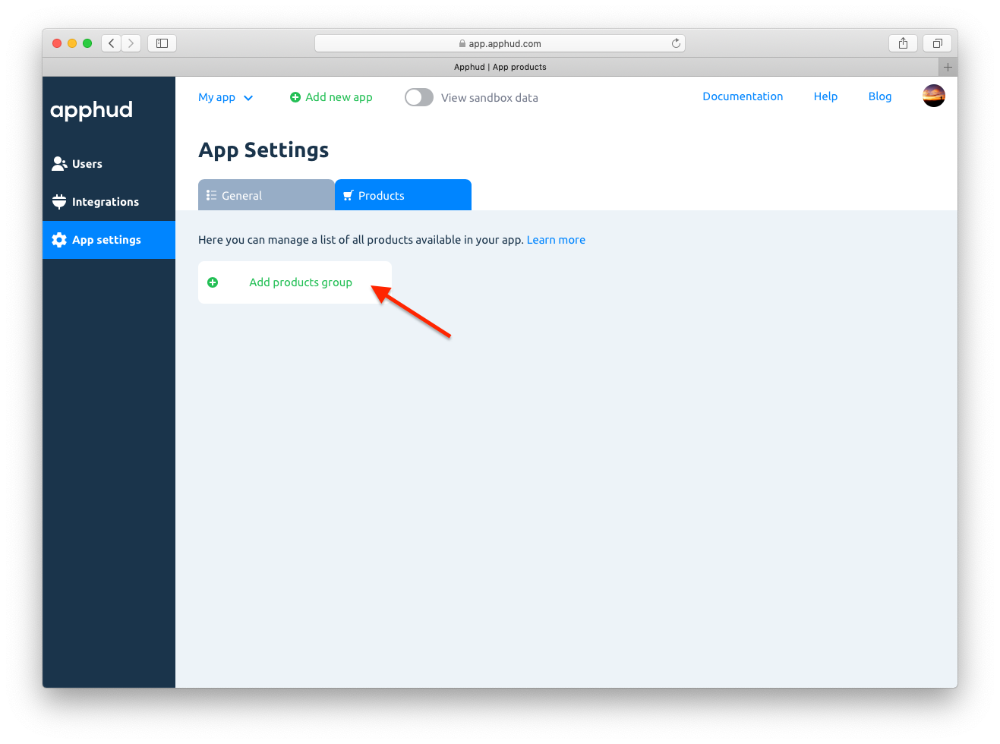
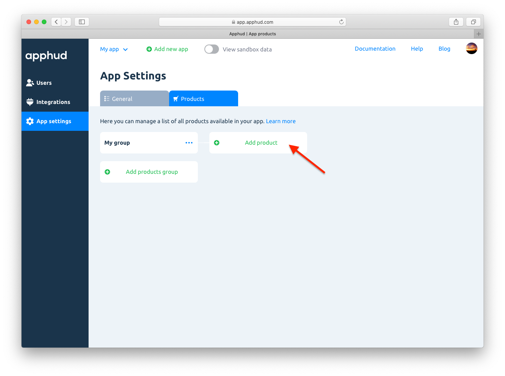

The structure of your subscription products and their subscription groups should match the structure at <a href="https://appstoreconnect.apple.com/" target="_blank">App Store Connect</a>.

> Unfortunately, Apple doesn't have API to get products structure. That is why you should add the same structure again.

*Important: if you add new products at App Store Connect, don't forget to add them to Apphud. If you delete live products from App Store Connect, there is no need to delete them from Apphud. Also it's not recommended to change subscriptions prices after SDK integration as it may show incorrect revenue in some cases. You can create new product with new price instead.*

## Adding subscription groups

Click on *“Add products group”*. The name of subscription group will be shown in reports and analytics.

## Adding product

To add a product click on *“Add a product”*. Enter your *Product ID* and click *“Create”*.

