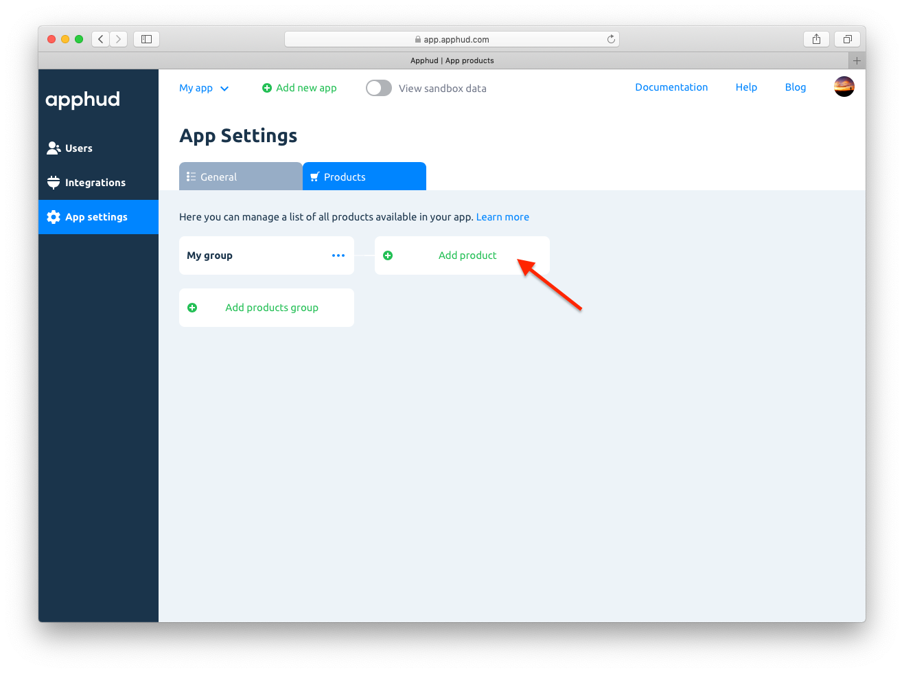

Структура групп продуктов (подписок) и самих продуктов (подписок) внутри них должна **точно соответствовать** их структуре в <a href="https://appstoreconnect.apple.com/" target="_blank">App Store Connect</a>. Это требуется для правильной работы сервиса.

> К сожалению, у Apple нет API для загрузки продуктов из <a href="https://appstoreconnect.apple.com/" target="_blank">App Store Connect</a>. Поэтому вам придется вручную продублировать их структуру в Apphud.
>

*ВАЖНО: если вы добавляете новые продукты в <a href="https://appstoreconnect.apple.com/" target="_blank">App Store Connect</a>, не забывайте их сразу же добавлять и в Apphud. Удалять же старые продукты из Apphud не нужно. Не рекомендуется менять цены на уже существующие продукты после интеграции Apphud. Вместо этого создайте новые продукты с новыми product_id и новой ценой.*

## Добавление группы продуктов

Нажмите *“Add products group”*, чтобы добавить новую группу продуктов. Придумайте название для нее, которое будет использовано в отчетах.

## Добавление продукта

Чтобы создать продукт, нажмите *“Add a product”*. Введите *Product ID* и нажмите *“Create”*.

