Amplitude is a powerful mobile analytics service. Send events to Amplitude via Apphud, analyze your users behavior and make necessary desicions.

## How to add integration? 

1. Open <a href="https://analytics.amplitude.com/" target="_blank">Amplitude</a> and sign in.
2. Click on *"Manage Data"* at the bottom of the screen:

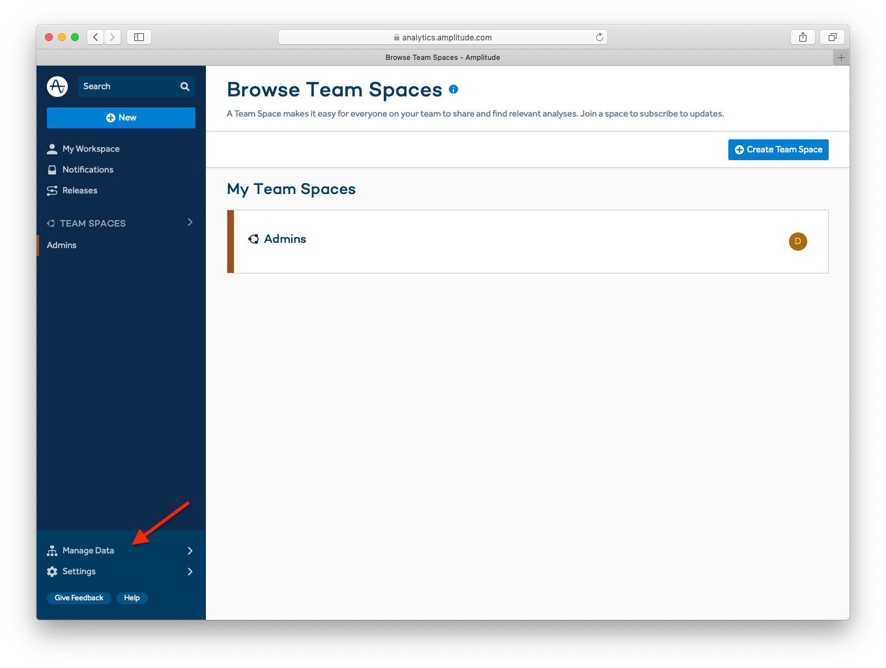

3. Choose your app:

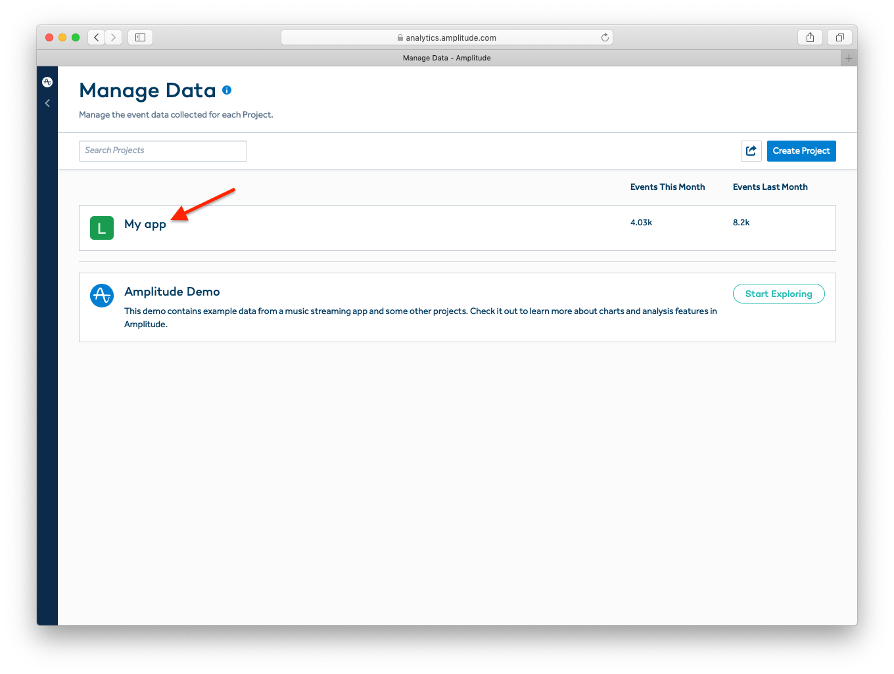

4. Copy *Amplitude API Key*:

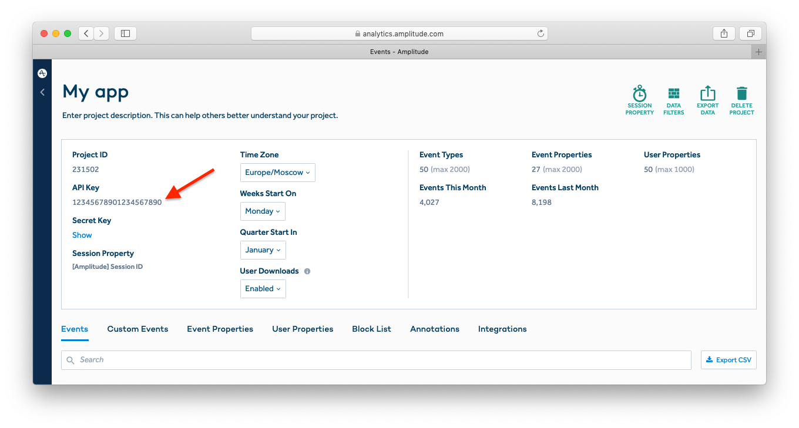

5. At <a href="https://app.apphud.com/" target="_blank">Apphud</a> go to *"Integrations"* section and add Amplitude: 

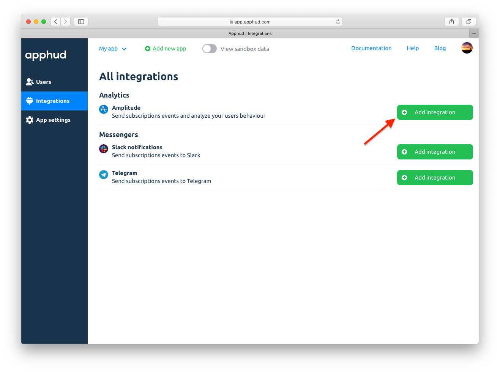

6. Enter *Amplitude API Key* at the *"Amplitude API Key"* field: 

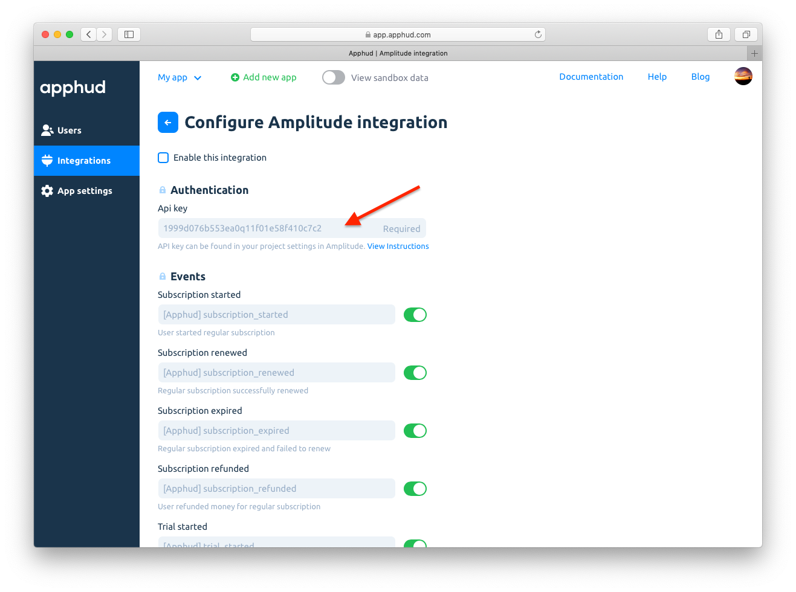

7. You can enter your custom event names or disable some:

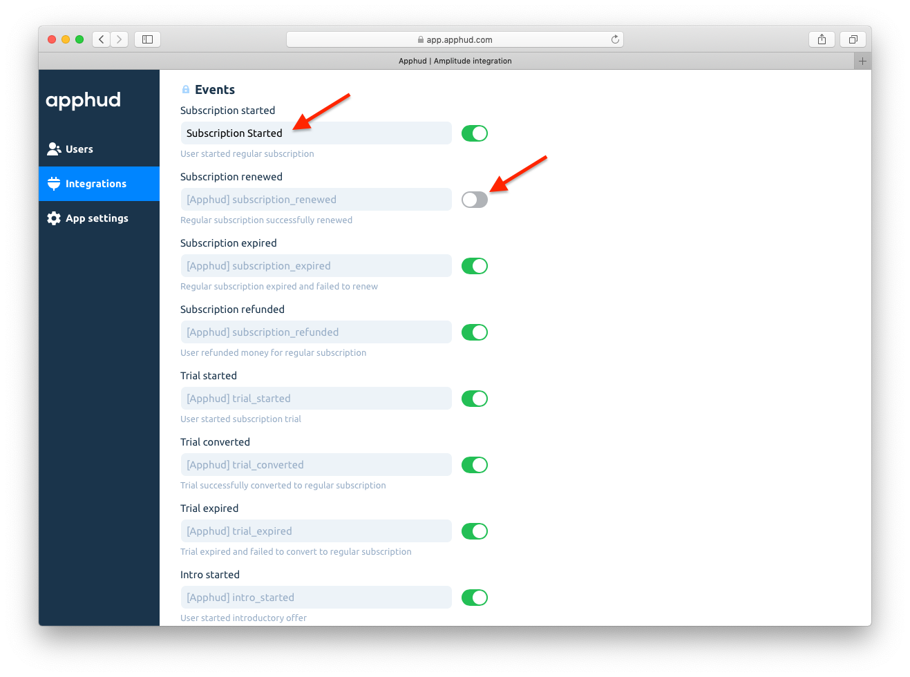

8. Tick *"Enable this integration"*:

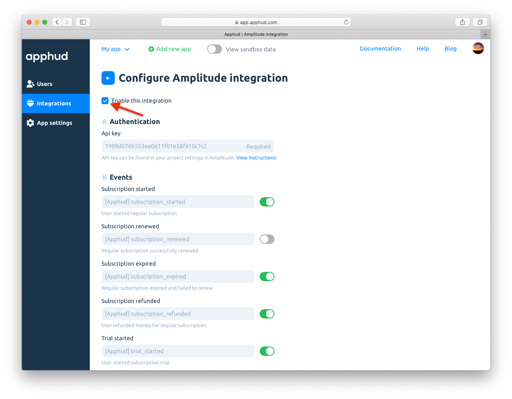

9. Save changes:

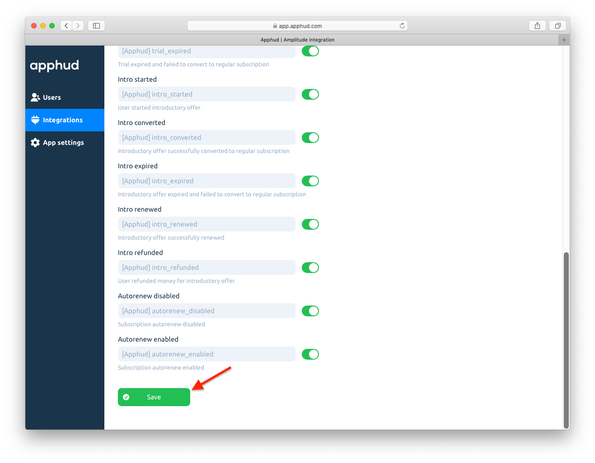

## Events

This is a table of all possible events and their parameters that are being sent to Amplitude. 

> You can get more details regarding events [here](events.md) and event parameters description - [here](integrations.md).

| Event                                                      | Default Name        | Parameters                                          |
| ------------------------------------------------------------ | -------------------------------- | ------------------------------------------------------------ |
| *Trial Period*                               |                                  |                                                              |
| Trial period started                    | `[Apphud] trial_started`         | `product_id`: String `unit`: String `units_count`: Integer |
| Successful conversion from trial period to regular subscription | `[Apphud] trial_converted`       | `product_id`: String `local_price`: Float `currency`: String `usd_price`: Float |
| Failed conversion from trial period to regular subscription | `[Apphud] trial_expired`         | `product_id`: String `reason`: String                     |
| *Introductory offer*                  |                                  |                                                              |
| Introductory offer started | `[Apphud] intro_started`         | `product_id`: String `local_price`: Float `currency`: String `usd_price`: Float `offer_type`: String `unit`: String `units_count`: Integer |
| Introductory offer renewed | `[Apphud] intro_renewed`         | `product_id`: String `local_price`: Float `currency`: String `usd_price`: Float `offer_type`: String `unit`: String `units_count`: Integer |
| Successful conversion from introductory offer to regular subscription | `[Apphud] intro_converted`       | `product_id`: String `local_price`: Float `currency`: String `usd_price`: Float `offer_type`: String |
| Failed conversion from introductory offer to regular subscription or failed renew | `[Apphud] intro_expired`         | `product_id`: String `reason`: String `offer_type`: String |
| Refund during introductory offer | `[Apphud] intro_refunded`        | `product_id`: String `local_price`: Float `currency`: String `usd_price`: Float `reason`: String `offer_type`: String |
| *Regular subscription*       |                                  |                                                              |
| Subscription started | `[Apphud] subscription_started`  | `product_id`: String `local_price`: Float `currency`: String `usd_price`: Float |
| Subscription renewed     | `[Apphud] subscription_renewed`  | `product_id`: String `local_price`: Float `currency`: String `usd_price`: Float |
| Subscription expired | `[Apphud] subscription_expired`  | `product_id`: String `reason`: String                     |
| Subscription refunded | `[Apphud] subscription_refunded` | `product_id`: String `local_price`: Float `currency`: String `usd_price`: Float `reason`: String |
| *Autorenew settings*              |                                  |                                                              |
| Autorenew disabled         | `[Apphud] autorenew_disabled`    | `product_id`: String                     |
| Autorenew enabled                 | `[Apphud] autorenew_enabled`     | `product_id`: String                                         |

> Set up Subscription Status URL to receive `autorenew_disabled` and `autorenew_enabled` events in real-time. More information can be found [here](creating-app.md#subscription-status-url).
>

These events:

* `[Apphud] trial_converted`,
* `[Apphud] intro_started`,
* `[Apphud] intro_renewed`,
* `[Apphud] intro_converted`,
* `[Apphud] intro_refunded`,
* `[Apphud] subscription_started` 
* `[Apphud] subscription_renewed`,
* `[Apphud] subscription_refunded` 

can be optionally sent to Amplitude with additional parameters. You can enable Amplitude's built-in revenue tracking events. More information can be found <a href="https://help.amplitude.com/hc/en-us/articles/115002278527#tracking-revenue" target="_blank">here</a>. Using this you will be able to use Amplitude's built-in revenue tracking reports. By default this option is __off__, but you can enable this feature in integration settings:

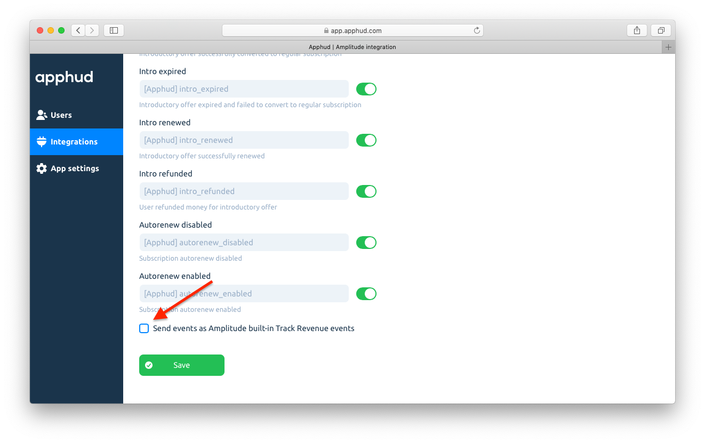

These are parameters that are sent with these events:

| Parameter     | Type    | Description                                                  |
| ------------- | ------- | ------------------------------------------------------------ |
| `productID`   | String  | Product ID                                                   |
| `quantity`    | Integer | Quantity of products. *Always equals 1*                      |
| `price`       | Float   | The price of purchase in US dollars.                         |
| `revenueType` | String  | Name of event. Possible value: `trial_converted`, `intro_started`, `intro_renewed`, `intro_converted`, `intro_refunded`, `subscription_started`, `subscription_renewed`, `subscription_refunded` |

## User properties

In the table below you can see the list of user properties that are sent to Amplitude.

> More information about user properties can be found [here](integrations.md).

| Parameter                       | Type    |
| ------------------------------- | ------- |
| `[Apphud] status-group_name`    | String  |
| `[Apphud] autorenew-group_name` | Boolean |
| `[Apphud] total_spent`          | Float   |
| `[Apphud] paying`               | Boolean |
| `[Apphud] payments_count`       | Integer |

## Sending test event

You may send test event to Amplitude to check if integration is set up correctly. Click *"…"* and then in dropdown click on *"Send test event"*:

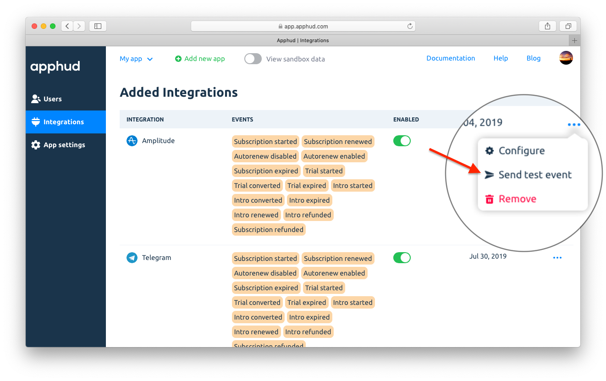

You will see new user under *"User Look-Up"* report:

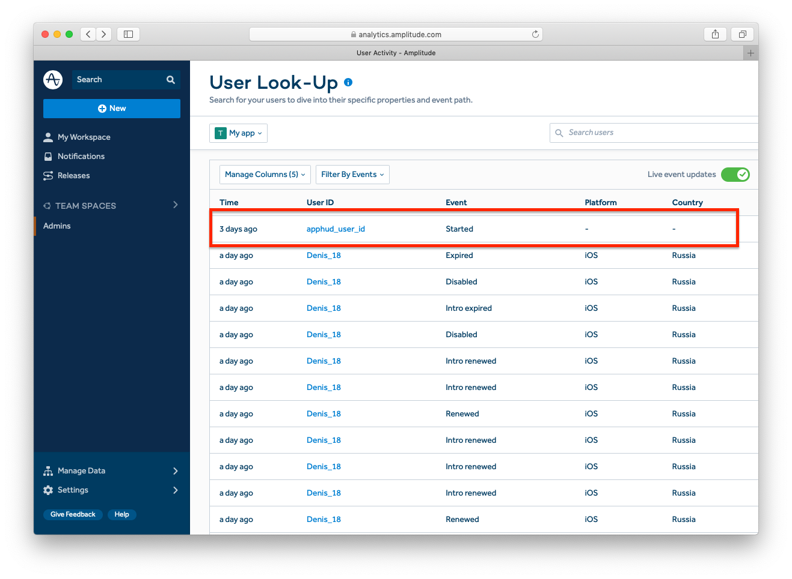