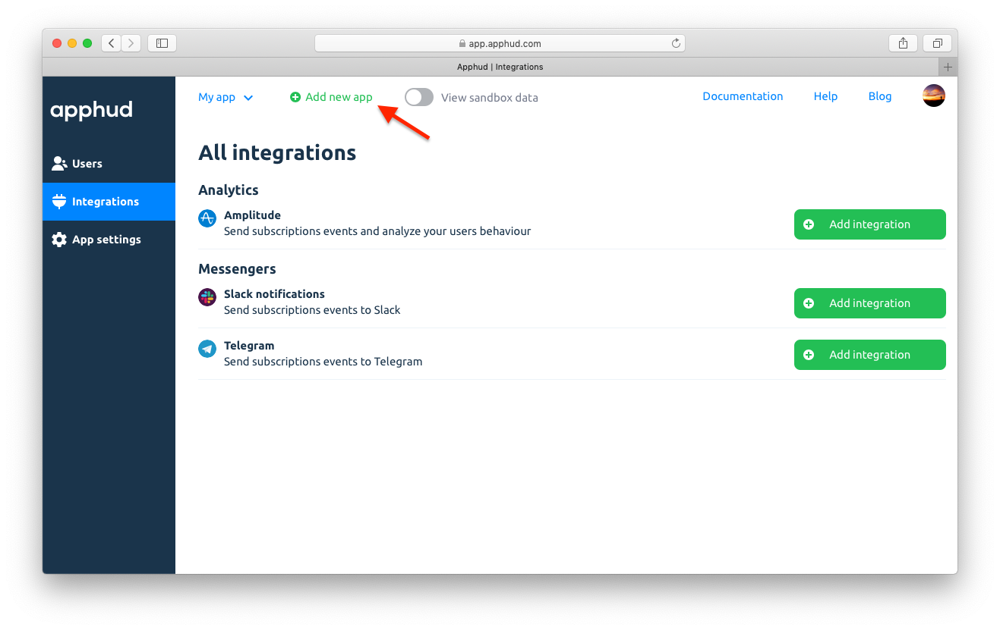

To create a new app, click on "Add new app" at the top:

Or just register and application create screens will show automatically. Fill the information about the app.

## App Name

This is a name of the app that will be used in reports.

## Bundle ID

To get Bunde ID open <a href="https://appstoreconnect.apple.com/" target="_blank">App Store Connect</a>, go to *"My Apps"* and choose your app. 

At the app page find *“Your Bundle ID”*.

## App Store Shared Secret

To get shared secret:

1. Open <a href="https://appstoreconnect.apple.com/" target="_blank">App Store Connect</a>, go to my *“My Apps”* and choose your app.
2. Go to *"Features"* and select *“In-App Purchases”*.
3. Click on *“View Shared Secret”*. Generate a new one if you don't have it yet.

## Subscription Status URL

We highly recommend to paste generated Subscription Status URL at your app page of <a href="https://appstoreconnect.apple.com/" target="_blank">App Store Connect</a>. It will help to create events in real-time.

> More information about event can be found [here](events.md).

1. Open <a href="https://appstoreconnect.apple.com/" target="_blank">App Store Connect</a>, go to *“My Apps”* and choose your app.
2. Under *"General Information"* find *"Subscription Status URL"*, paste generated URL and save changes.