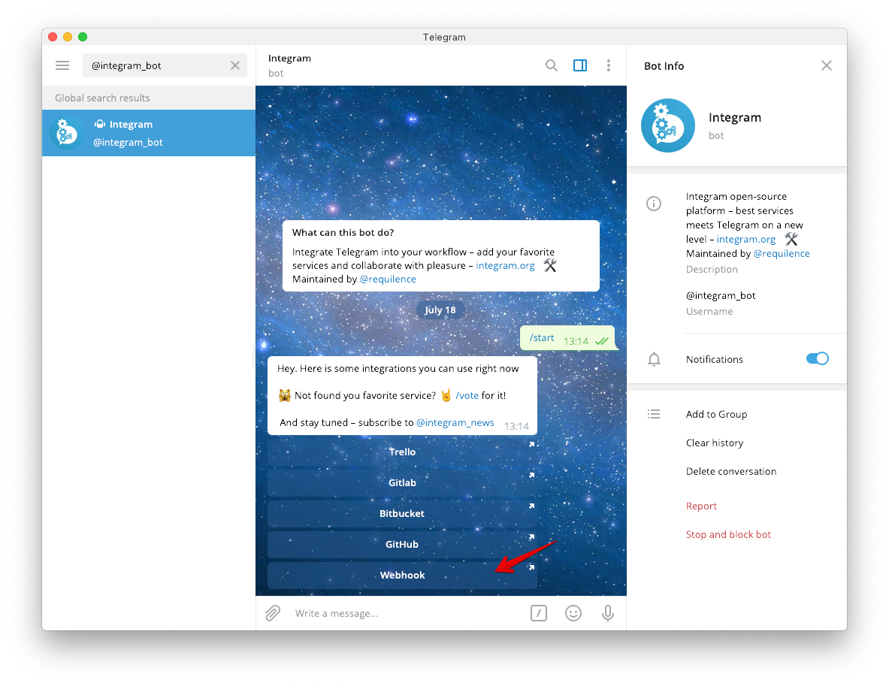
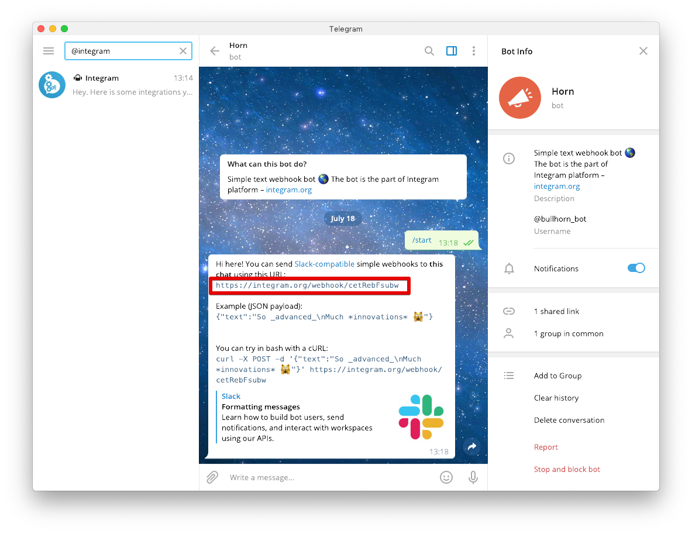

Получайте события о новых и существующих подписках в Telegram используя Webhook URL.

## Как добавить интеграцию?

1. Перейдите по ссылке https://t.me/integram_bot или откройте Telegram и найдите в поиске бота *@integram_bot*:

2. Нажмите *"Start"* и выберите *"Webhook"*:

3. Скопируйте Webhook URL из бота [@bullhorn_bot](https://t.me/bullhorn_bot):

4. Перейдите на страницу "Integrations" в [Apphud](https://app.apphud.com) и

