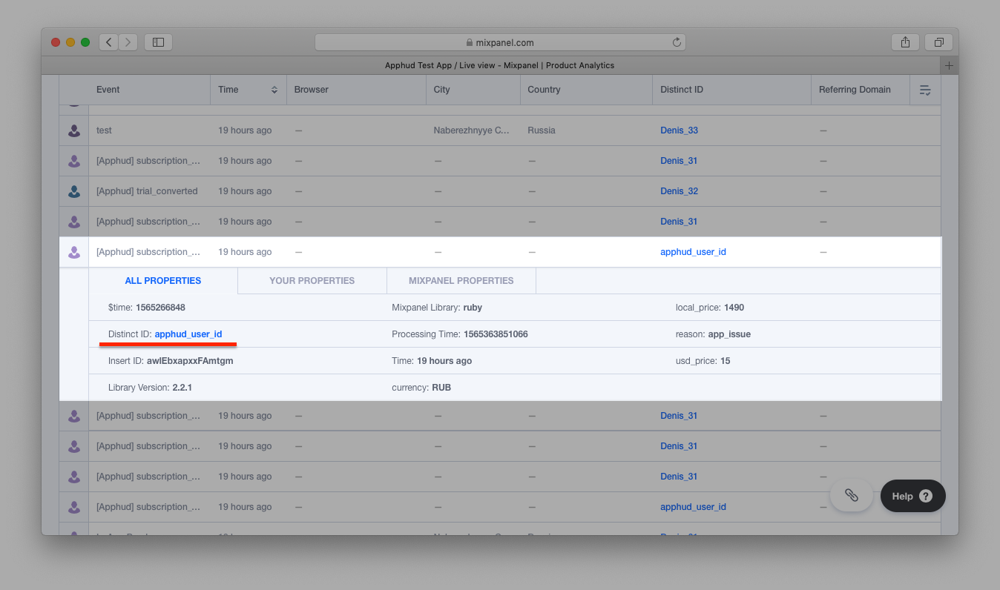

Mixpanel is a powerful mobile analytics service. Send events to Mixpanel via Apphud, analyze your users behavior and make necessary desicions.

## How to Add Integration? 

1. Open <a href="https://mixpanel.com/" target="_blank">Mixpanel</a> and sign in.
2. Open *Project Settings*:

3. Scroll down and copy *API Key*:

4. In order not to receive Mixpanel's automatic In-App purchase events **we highly recommend** to disable collection common mobile events. Otherwise if user, for example, starts a trial period Mixpanel will consider this as a revenue.

5. At <a href="https://app.apphud.com/" target="_blank">Apphud</a> go to *"Integrations"* section and add Mixpanel: 

6. Enter *Mixpanel API Key* at the *"API Key"* field: 

7. You can enter your custom event names or disable some:

8. Tick *"Enable this integration"*:

9. If you want to send Revenue information to Mixpanel, check *"Send Revenue properties to Mixpanel"*. Click *"Save"*:

## Events

This is a table of all possible events and their parameters that are being sent to Mixpanel. 

> You can get more details regarding events [here](events.md) and event parameters description - [here](integrations.md).

| Event                                                      | Default Name        | Parameters                                          |
| ------------------------------------------------------------ | -------------------------------- | ------------------------------------------------------------ |
| *Trial Period*                               |                                  |                                                              |
| Trial period started                    | `[Apphud] trial_started`         | `product_id`: String `unit`: String `units_count`: Integer |
| Successful conversion from trial period to regular subscription | `[Apphud] trial_converted`       | `product_id`: String `local_price`: Float `currency`: String `usd_price`: Float |
| Failed conversion from trial period to regular subscription | `[Apphud] trial_expired`         | `product_id`: String `reason`: String                     |
| *Introductory offer*                  |                                  |                                                              |
| Introductory offer started | `[Apphud] intro_started`         | `product_id`: String `local_price`: Float `currency`: String `usd_price`: Float `offer_type`: String `unit`: String `units_count`: Integer |
| Introductory offer renewed | `[Apphud] intro_renewed`         | `product_id`: String `local_price`: Float `currency`: String `usd_price`: Float `offer_type`: String `unit`: String `units_count`: Integer |
| Successful conversion from introductory offer to regular subscription | `[Apphud] intro_converted`       | `product_id`: String `local_price`: Float `currency`: String `usd_price`: Float `offer_type`: String |
| Failed conversion from introductory offer to regular subscription or failed renew | `[Apphud] intro_expired`         | `product_id`: String `reason`: String `offer_type`: String |
| Refund during introductory offer | `[Apphud] intro_refunded`        | `product_id`: String `local_price`: Float `currency`: String `usd_price`: Float `reason`: String `offer_type`: String |
| *Regular subscription*       |                                  |                                                              |
| Subscription started | `[Apphud] subscription_started`  | `product_id`: String `local_price`: Float `currency`: String `usd_price`: Float |
| Subscription renewed     | `[Apphud] subscription_renewed`  | `product_id`: String `local_price`: Float `currency`: String `usd_price`: Float |
| Subscription expired | `[Apphud] subscription_expired`  | `product_id`: String `reason`: String                     |
| Subscription refunded | `[Apphud] subscription_refunded` | `product_id`: String `local_price`: Float `currency`: String `usd_price`: Float `reason`: String |
| *Promotional offer* |  |  |
| Promotional offer started | `[Apphud] promo_started` | `product_id`: String `local_price`: Float `currency`: String `usd_price`: Float `offer_type`: String `unit`: String `units_count`: Integer |
| Promotional offer renewed | `[Apphud] promo_renewed` | `product_id`: String `local_price`: Float `currency`: String `usd_price`: Float `offer_type`: String `unit`: String `units_count`: Integer |
| Successful conversion from promotional offer to regular subscription | `[Apphud] promo_converted` | `product_id`: String `local_price`: Float `currency`: String `usd_price`: Float `offer_type`: String |
| Failed conversion from promotional offer to regular subscription or failed renew | `[Apphud] promo_expired` | `product_id`: String `reason`: String `offer_type`: String |
| Refund during promotional offer | `[Apphud] promo_refunded` | `product_id`: String `local_price`: Float `currency`: String `usd_price`: Float `reason`: String `offer_type`: String |
| *Autorenew settings*              |                                  |                                                              |
| Autorenew disabled         | `[Apphud] autorenew_disabled`    | `product_id`: String                     |
| Autorenew enabled                 | `[Apphud] autorenew_enabled`     | `product_id`: String                                         |

> Set up Subscription Status URL to receive `autorenew_disabled` and `autorenew_enabled` events in real-time. More information can be found [here](creating-app.md#subscription-status-url).
>

These events:

- `[Apphud] trial_converted`,
- `[Apphud] intro_started`,
- `[Apphud] intro_renewed`,
- `[Apphud] intro_converted`,
- `[Apphud] intro_refunded`,
- `[Apphud] subscription_started` 
- `[Apphud] subscription_renewed`,
- `[Apphud] subscription_refunded`,
- `[Apphud] promo_started`,
- `[Apphud] promo_renewed`,
- `[Apphud] promo_converted`,
- `[Apphud] promo_refunded`,

can be optionally sent to Mixpanel with Mixpanel's build-in **Revenue parameter** converted to USD. By default this option is __off__, but you can enable this feature in integration settings:

## User Properties

In the table below you can see the list of user properties that are sent to Mixpanel.

> More information about user properties can be found [here](integrations.md).

| Parameter                       | Type    |
| ------------------------------- | ------- |
| `[Apphud] status-group_name`    | String  |
| `[Apphud] autorenew-group_name` | Boolean |
| `[Apphud] total_spent`          | Float   |
| `[Apphud] paying`               | Boolean |
| `[Apphud] payments_count`       | Integer |

## Sending Test Event

You may send test event to Mixpanel to check if integration is set up correctly. Click *"…"* and then in dropdown click on *"Send test event"*:

You will see new user in *"Live view"* report:

