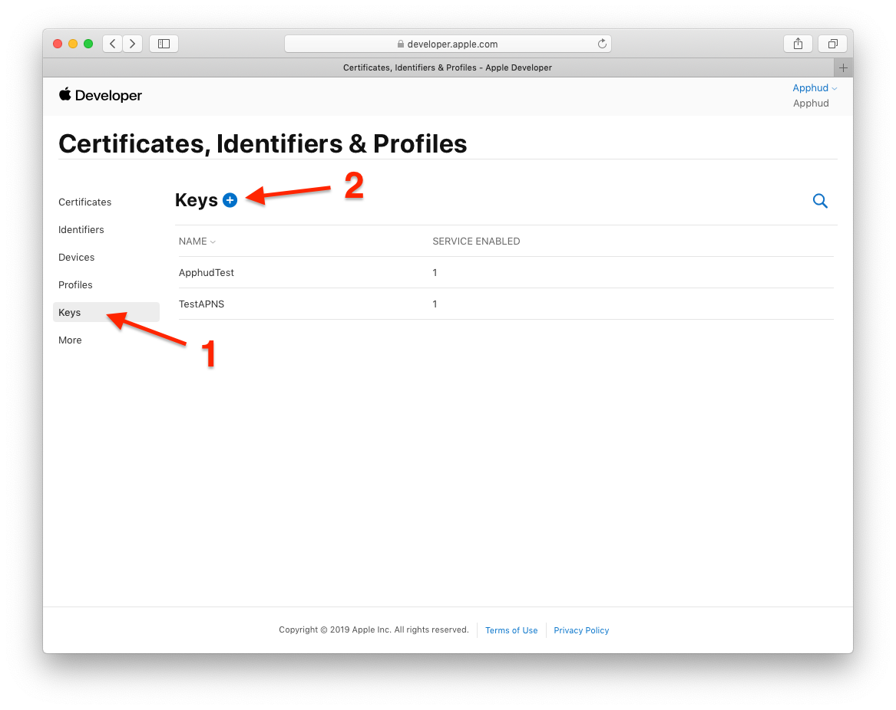
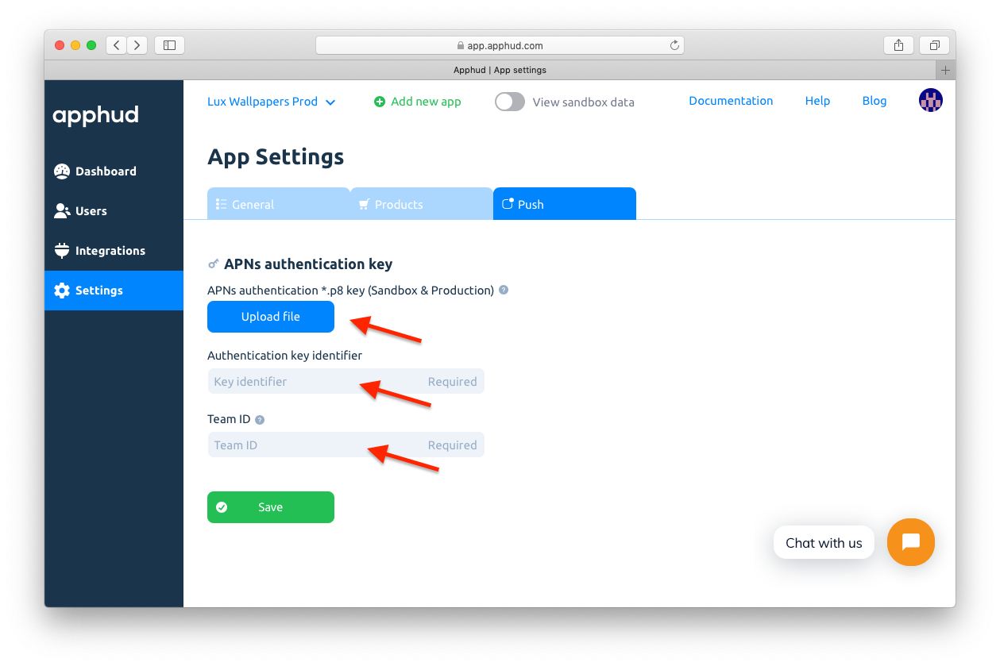
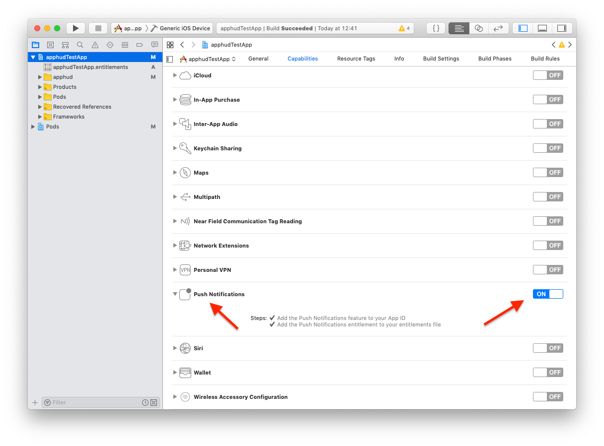

Integrating Push notifications in your app will let you to use Rules – the powerful feature of winning back lapsed customers or notifying them about their billing issues.

## Generate Push Notifications Auth Key

Go to the <a href="https://developer.apple.com/account/ios/profile/" target="_blank">Apple Developer Center</a>, then go to *"Keys"* page, then create a new key by entering a name and choosing *"Apple Push Notifications service (APNs)"*.



Once created, download the file and move it to the safe place. You will need to upload it to Apphud. 

Also copy your team ID somewhere which can be found in your <a href="https://developer.apple.com/account/#/membership" target="_blank">Developer Account Membership</a> page. We will need it later.

> Auth Key file name has the following format: AuthKey_[KEY_ID].p8, where KEY_ID is your Key Identifier.
>
> By using auth key, Apphud will be able to send Push notifications to all of your apps within the same account and to both sandbox and production environments. That means, you can use the same auth key file for your another app.

## Upload Auth Key to Apphud

Go to <a href="https://app.apphud.com" target="_blank">Apphud Dashboard</a> and open *"App settings"*, there click on *"Push"* tab. There you will see *Upload* button for APNs auth key file. Just upload your Key file there. Also enter your Team ID and make sure key identifier is also entered.



## Set up Push Notifications in iOS app

Make sure that Push Notifications are turned on in *"Capabilities"* section of your app target:



Let's write some code in your `AppDelegate`. First, register for notifications:

```swift
import UserNotifications

func application(_ application: UIApplication, didFinishLaunchingWithOptions launchOptions: [UIApplication.LaunchOptionsKey: Any]?) -> Bool {
  Apphud.start(apiKey: YOUR_API_KEY)
  registerForNotifications()
  //... the rest of your code
}

func registerForNotifications(){
	UNUserNotificationCenter.current().delegate = self
	UNUserNotificationCenter.current().requestAuthorization(options: [.alert, .badge, .sound])	{ (granted, error) in            
		// handle if needed
	}        
	UIApplication.shared.registerForRemoteNotifications()
}
```

Then you will need to submit device token to Apphud:

```swift
func application(_ application: UIApplication, didRegisterForRemoteNotificationsWithDeviceToken deviceToken: Data) {
	Apphud.submitPushNotificationsToken(token: deviceToken, callback: {_ in})
}

func application(_ application: UIApplication, didFailToRegisterForRemoteNotificationsWithError error: Error) {
	// error occurred. Probably you have signing issues or push notifications capabilities are	// turned off
}
```

After that we should handle incoming Push notification payload. This is done with two methods: one handles payload when app is in background or not launched, another handles payload when app is running.

```swift
func userNotificationCenter(_ center: UNUserNotificationCenter, didReceive response: UNNotificationResponse, withCompletionHandler completionHandler: @escaping () -> Void) {
	Apphud.handlePushNotification(apsInfo: response.notification.request.content.userInfo)
	completionHandler()
}
    
func userNotificationCenter(_ center: UNUserNotificationCenter, willPresent notification: UNNotification, withCompletionHandler completionHandler: @escaping (UNNotificationPresentationOptions) -> Void) {
	Apphud.handlePushNotification(apsInfo: notification.request.content.userInfo)
	completionHandler([]) // return empty array to skip showing notification banner
}
```

That's it. Next run the app and make sure that `didRegisterForRemoteNotificationsWithDeviceToken` is called and `deviceToken` is successfully sent to Apphud.

Now you are ready to receive Push notifications.
