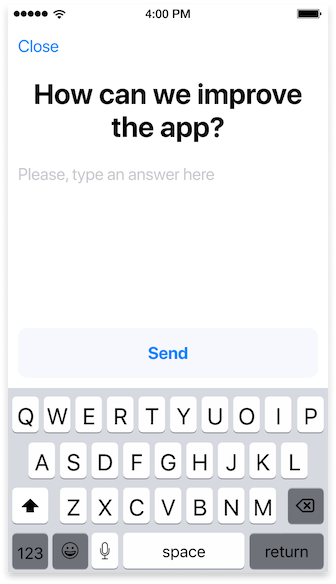
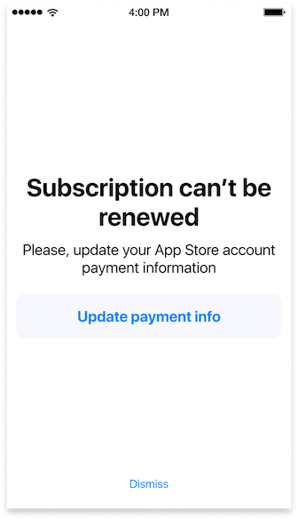

Apphud may win back lapsed subscribers and reduce churn rate of your iOS app using the mechanics below. This can be done using Rules.

> In order to make rules work you must:
>
> - add Subscription Status URL to your app settings in <a href="https://appstoreconnect.apple.com/" target="_blank">App Store Connect</a>. Read more [here](creating-app.md#app-store-shared-secret).
> - configure Push notifications. [View instructions](push.md) how to do it.
>

### When a user cancels a subscription or trial

When a user cancels a subscription or trial, Apphud will immediately send push-notification offering him to pass a survey. You can specify survey question and available options. Usually this question looks like: *"Why did you cancel a subsctiption / trial?"*. It looks like this:


Depending on an answer Apphud will:

* if a user chose an option like *"I don't need Premium plan"*, ask a user to send additional feedback:



or

* if a user chooses an option *"The subscription is too expensive"*, Apphud will show a [purchase screen](purchase-screens.md), where a user can redeem a discount or activate additional trial period. You don't need to manually design and code purchase screens and implement promotional offers. Apphud will do everything for you. This the example of purchase screen:


Even if a user didn't open push-notification (for example, if it wasn't delivered), he will see a survey next time he opens the app.

### When a billing issue occurs during renewal

Apphud may also handle a situation if a subsctiption wasn't renewed because of billing issue. Once billing issue occurs a user will receive a push notification with a text you may specify. Usually it's something like: *"A billing issue occurred during renewal. Please open notification to update payment info"*. After opening the app he will see this modal screen:



If a user taps *"Update payment info"* button he will be redirected directly to App Store payment info screen where he could fix the billing issue.

## Configuring Rules

Rules can be configured at *"Rules"* section. To add a new rule, click *"Add a rule"* button. Configure a new rule.

> Once created, rule can not be modified. You could change only it's name.

### Rule name

A name for the rule.

### Min iOS version

Only a users with this (and higher) iOS version installed will receive a notification.

> Promotional offers are only available on devices with iOS 12.2+ installed.

### When to trigger a rule

Select when the rule will be executed. The possible options are:

* a user cancel an active subscription;
* a user cancel trial subscription;
* billing issue occurred.

> You can only have one rule of each trigger type at any moment.

### Push notification text

Enter the text which will be shown in push notification.

### Survey question

The question which will be shown in a survey with a question and options.

### Survey options

Possible options of the question.

#### Option title

 The title of the option.

#### What to do

Select what Apphud should do if a user select this option. The possible options are:

* present purchase screen: select a purchase screen to show. You can win back the user by proving him a good discount or additional trial period.

> You may read more about purchase screens [here](purchase-screens.md).

* question: enter the question that you would like to ask a user to receive feedback.

------

> Don't forget to enable "Enable this rule" checkbox.

## Testing Rules

To test a rule simply create any and select '*Test*' tab. Enter you device's Push token and click '*Send*'.


Device Push token is a string that can be found either in Apphud or in code:

- On user's page in Apphud "*Users*" section. Just find yourself and get your token. 

- Inside `application:didRegisterForRemoteNotificationsWithDeviceToken:` method add the following line to get your token string: 

  ```swift
  let tokenString = deviceToken.map { String(format: "%02.2hhx", $0) }.joined()
  ```


If you received Push notification then set up is complete.

## Rules Analytics

You can view results of rules efficiency on *"Analyze"* tab.
