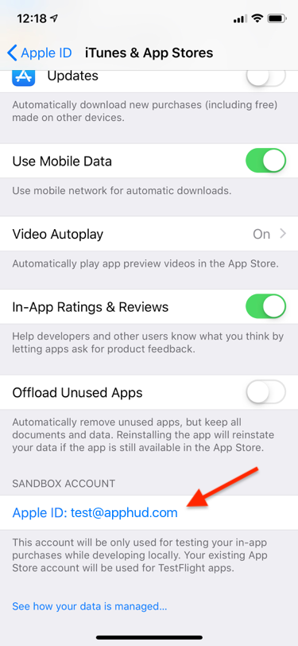

In this section we will show how to test auto-renewable subscriptions in your app.

## Create sandbox account

> You can read more about testing and setting up auto-renewable subscriptions in <a href="https://blog.apphud.com/ru/swift-tutorial-subscriptions-ru/" target="_blank">our blog</a>.

To test in app purchases you need to create sandbox user. Go to <a href="https://appstoreconnect.apple.com/" target="_blank">App Store Connect</a> and open *"Users and Access"*, then – *"Sandbox Testers"*.

> You can read more about creating sandbox tester <a href="https://help.apple.com/app-store-connect/#/dev8b997bee1" target="_blank">here</a>.
>

Since iOS 12 you can sign in to sandbox account separately from your App Store account. Sign in to sandbox here:

 

## Purchasing

Purchasing process is the same as real in-app purchases. The only differency is accelerated time and impossibility to cancel subscription manually. Subscriptions in sandbox renew maximum 6 times per day.

| **Real duration** | **Duration in sandbox** |
| ----------------- | ----------------------- |
| 1 week            | 3 minutes               |
| 1 month           | 5 minutes               |
| 2 months          | 10 minutes              |
| 3 months          | 15 minutes              |
| 6 months          | 30 minutes              |
| 1 year            | 1 hour                  |

If after purchase in Apphud you can see a user with active subscription, it means that payment process work correctly.

## Which events can be tested in sandbox?

You can test following events in sandbox:

- Trial Started
- Trial Converted
- Intro Started
- Intro Converted
- Intro Renewed
- Intro Expired (if payment mode is "Pay as you go" and number of introductory periods is *at least six*)
- Subscription Started
- Subscription Renewed
- Subscription Expired
- Autorenew Disabled
- Autorenew Enabled

> You can read more about events [here](events.md).

