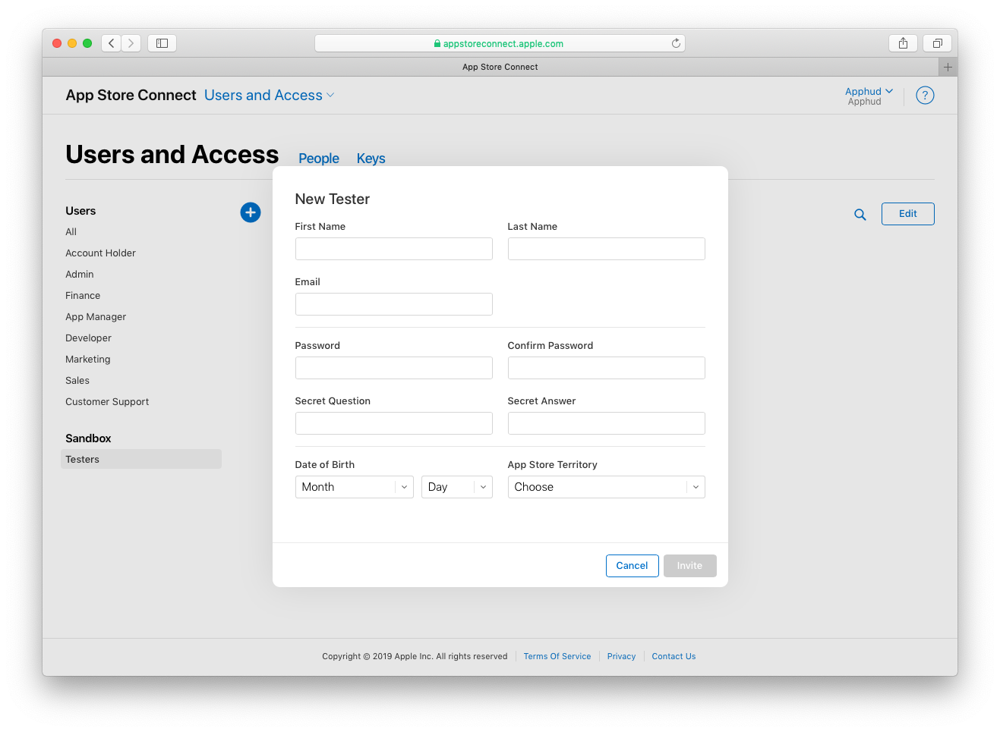

В этом разделе мы расскажем, как протестировать автоматические подписки в вашем приложении.

## Создание аккаунта

> Более подробно об авто-возобновляемых подписках, их настройке и тестирование вы так же можете прочитать в <a href="https://blog.apphud.com/ru/swift-tutorial-subscriptions-ru/" target="_blank">нашей статье</a>.

Для тестирования будущих покупок вам нужно будет создать тестового пользователя. Для этого перейдите в <a href="https://appstoreconnect.apple.com/" target="_blank">App Store Connect</a> во вкладку *"Пользователи и Доступ"*, далее – в *"Тестировщики Sandbox"*.

> Более подробно о создании sandbox тестировщика вы можете прочитать <a href="https://help.apple.com/app-store-connect/#/dev8b997bee1" target="_blank">здесь</a>.
>

Раньше для тестирования покупок необходимо было выходить из App Store в настройках вашего iPhone. Это было неудобно: например, стиралась вся медиатека Apple Music. Но сейчас этого делать не нужно: аккаунт песочницы теперь существует отдельно от основного аккаунта. Вы можете подключить этот аккаунт в настройках iPhone:

 

## Оплата

Сам процесс оплаты в Sandbox ничем не отличается от реальной оплаты через App Store. Единственная разница – ускоренное время истечения подписок и невозможность отменить автовозобновление в настройках. Подписки возобновляются не более 6 раз в день.

| **Фактическая длительность** | **Длительность для тестирования** |
| ---------------------------- | --------------------------------- |
| 1 неделя                     | 3 минуты                          |
| 1 месяц                      | 5 минут                           |
| 2 месяца                     | 10 минут                          |
| 3 месяца                     | 15 минут                          |
| 6 месяцев                    | 30 минут                          |
| 1 год                        | 1 час                             |

Если после оплаты на странице пользователей Apphud появился пользователь с оплаченной подпиской, значит, настройка прошла успешно.

## Какие события можно протестировать в Sandbox?

Вы можете протестировать следующие события в Sandbox:

- Trial Started
- Trial Converted
- Intro Started
- Intro Converted
- Intro Renewed
- Intro Expired (если вводное предложение имеет тип "Pay as you go" и количество периодов со скидкой *больше шести*)
- Subscription Started
- Subscription Renewed
- Subscription Expired
- Autorenew Disabled
- Autorenew Enabled

> Более подробно о событиях вы можете почитать [здесь](events.md)

