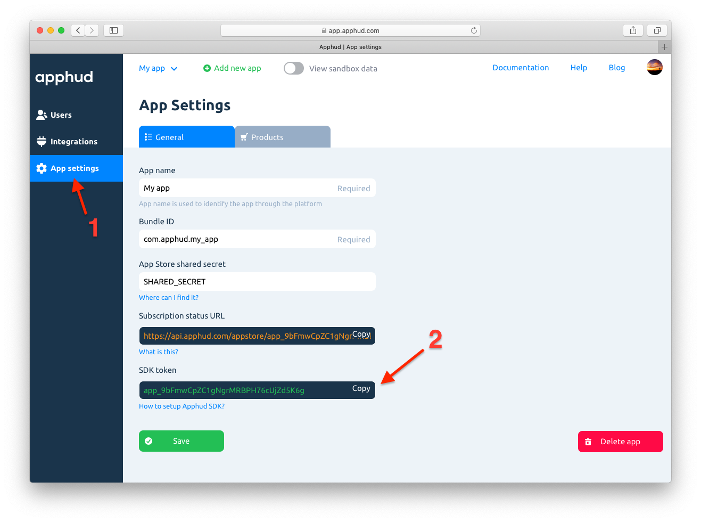

Here we describe how to add Apphud SDK to your iOS app.

## Requirements

Apphud SDK requires minimum iOS 11.2 and Xcode 10 and uses Swift version 5.0. 

## Installation

Apphud SDK can be installed via CocoaPods or manually.

##### Install via CocoaPods

Add the following line to your Podfile:

```ruby
pod 'ApphudSDK'
```

> In Objective-C project make sure `use_frameworks!` is added in your Podfile.

And then run in the Terminal:

```ruby
pod install
```

#### Manual Installation

Copy all files in `Source` folder to your project.


## Configuring Apphud SDK

To set up Apphud SDK you will need API Key. It is a unique identifier of your Apphud application. You can get it in your Apphud application settings under `General` tab.



Basic initialization looks like this:

```swift
import ApphudSDK

func application(_ application: UIApplication, didFinishLaunchingWithOptions launchOptions: [UIApplication.LaunchOptionsKey: Any]?) -> Bool {
	
  Apphud.start(apiKey: "YOUR_API_KEY")
  
  // the rest of your code
  return true
}
```

> In Objective-C project you should import like this: `#import <ApphudSDK-Swift.h>`

However if you want to use Integrations, you will need to update the code to set user identifier. See the bottom of this guide for details.


## Making a Purchase

There are two ways of submitting App Store receipt to Apphud: by making a purchase using our SDK or just sending App Store receipt after purchase has been made by yourself.

To make a purchase:

```swift
// when purchase button tapped
Apphud.purchase(product, callback: { (subscription, error) in
     // returns a subscription class that has been purchased and an optional error
})
```

Or just submit App Store receipt after successful purchase:

```swift
Apphud.submitReceipt(productIdentifier, callback: { (subscription, error) in
     // returns a subscription class that has been purchased and an optional error
})
```

Both methods will return a subscription model, which contains all relevant info about your subscription, including expiration date. See `ApphudSubscription.swift` file for details.

## Checking Subscription Status

```swift
Apphud.hasActiveSubscription()
```

Returns `true` if user has active subscription. Use this method to determine whether or not to unlock premium functionality to the user. To get subscription object (which contains expiration date, autorenew status, etc.) use the following method: 

```swift
Apphud.subscription()
```

 See `ApphudSubscription.swift` file for details.

## Restoring Purchases

If your app doesn't have a login system, which identifies a premium user by his credentials, then you need a restore mechanism. If you already have a restore purchases mechanism by calling `SKPaymentQueue.default().restoreCompletedTransactions()`, then you have nothing to worry about – Apphud SDK will automatically intercept and send latest App Store Receipt to Apphud servers when your restoration is completed. However, better to call our restore method from SDK:

```swift
Apphud.restoreSubscriptions{ subscriptions in 
   // handle here
}
```

Basically it just sends App Store Receipt to Apphud and returns subscriptions in callback (or `nil` if nothing was ever purchased).

## Migrating Existing Subscribers

If you already have an app with active subscribers and you want Apphud to track their subscriptions, you should submit their App Store receipts to Apphud at the first launch.

Use `restoreSubscriptions{}` method during first launch. You should also toggle a boolean value to avoid re-sending receipt in the next calls.

```swift
// isSubscriber - is your boolean value from your own purchase tracking code
if isSubscriber && !UserDefaults.standard.bool(forKey: "SubscriberReceiptSubmitted") {
	Apphud.restoreSubscriptions{ subscriptions in 
     // handle here
     UserDefaults.standard.set(true, forKey: "SubscriberReceiptSubmitted")
  }
}
```

## Setting up a Delegate

You can set up Apphud delegate by calling:

```swift
Apphud.setDelegate(self)
```

You can set a delegate at any time but after Apphud SDK has been initialized.

There are three optional methods that can be implemented in `ApphudDelegate` protocol.

#### StoreKit products fetched

```swift
@objc optional func apphudDidFetchStoreKitProducts(_ products: [SKProduct])
```

Returns array of StoreKit products. Note that you have to add all product identifiers in Apphud settings.

#### Subscription status updates

```swift
@objc optional func apphudSubscriptionsUpdated(_ subscriptions : [ApphudSubscription])
```

Reports when subscription status has been changed (for example, from `trial` to `expired`). In most cases you shouldn't use this method, it's just informational. `Apphud.hasActiveSubscription()` – is what you will need to check whether or not to give premium functionality to the user.

#### Change of `userID`.

```swift
@objc optional func apphudDidChangeUserID(_ userID : String)
```

This method gets called when `userID` value changes. `userID` identifies user across his multiple devices.

There are 2 cases when this method gets called:

* when user has restored subsciption from his another device.
* after manual call of `updateUserID(userID : String)` method. 

## User Identifier

There are two identifiers in Apphud SDK: device identifier and user identifier. 

### Device Identifier

Apphud SDK generates device identifier at the first launch of the app and saves it to keychain. It's used inside Apphud platform and cannot be accessed.

### User Identifier

If not set explicitly, user identifier is also generated at the first launch of the app.

> `userID` may change in case user has restored purchases from his another device. After Apphud receives the App Store receipt from iOS app, the server tries to find the same receipt in the database. If the same App Store receipt has been found and it already belongs to another user, Apphud will merge two users into a single user with two devices and then will return an original `userID`.

### User Identifier and Integrations

If you want to pass subscription events to your analytics services, such as Amplitude, you need to match Apphud `userID` with your analytics user identifier. There are two ways to implement this:

#### 1. Using Apphud `userID`

Add the following line when initializing SDK:

```swift
Apphud.start(apiKey: "YOUR_API_KEY")
Apphud.setDelegate(self)
Amplitude.instance()?.setUserId(Apphud.userID()) // or any other analytics
```

As we said previously, `userID` may change if user has restored purchases from his another device. You need to add the following delegate method as well:

```swift
func apphudDidChangeUserID(_ userID: String) {
	Amplitude.instance()?.setUserId(userID) // or any other analytics
}
```

#### 2. Using your own `userID`

Only do this if you are sure that your `userID`  explicitly identifies a user across his multiple devices. For example, if you have a login system with unique username and password, you can pass username as user ID. The only requirement is to update Apphud `userID` and your analytics `userID` simultaneously.

This can be done at app launch:

```swift
// at AppDelegate
Apphud.start(apiKey: "YOUR_API_KEY", userID: "YOUR_OWN_USER_ID")
Amplitude.instance()?.setUserId("YOUR_OWN_USER_ID") // or any other analytics
```

Or this can be done later:

```swift
// if authenticated
Apphud.updateUserID("YOUR_OWN_USER_ID")
Amplitude.instance()?.setUserId("YOUR_OWN_USER_ID") // or any other analytics
```

## About Currencies

US Dollar is a base currency in Apphud. All transactions are automatically converted to USD by the exchange rates at the time of event.

## Determing User Eligibility

You can use Apphud to determine if a user eligible to activate introductory or promotional offer:
```swift
// Checking eligibility for introductory offer
Apphud.checkEligibilityForIntroductoryOffer(product: myProduct) { result in
  if result {
    // User is eligible to purchase introductory offer
  }
}

// Checking eligibility for promotional offer
Apphud.checkEligibilityForPromotionalOffer(product: myProduct) { result in
  if result {
    // User is eligible to purchase promotional offer
  }
}
```

You may also check eligibility of multiple offers using just one SDK method: `checkEligibilitiesForPromotionalOffers(products: [SKProduct], callback: ApphudEligibilityCallback)` or `checkEligibilitiesForIntroductoryOffers(products: [SKProduct], callback: ApphudEligibilityCallback)`