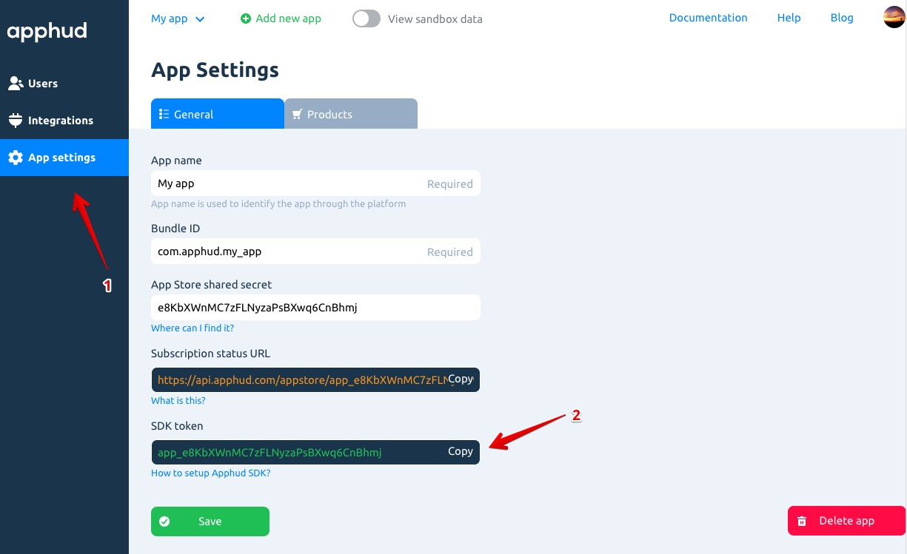

# Интеграция Apphud SDK

## Требования

iOS 11.2 и выше, Xcode 10 и выше, Swift 5.0 и выше.

## Установка

Apphud SDK может быть установлен через CocoaPods или вручную.

##### Установка через CocoaPods

Добавьте эту строку в Podfile:

```ruby
pod 'apphud'
```

И выполните в терминале:

```
pod install
```

##### Установка вручную

Добавьте все файлы из папки `Source` в ваш проект.

## Настройка Apphud SDK

Инициализируйте SDK в `AppDelegate`:

```swift
import apphud

func application(_ application: UIApplication, didFinishLaunchingWithOptions launchOptions: [UIApplication.LaunchOptionsKey: Any]?) -> Bool {
	
  Apphud.start(apiKey: "YOUR_API_KEY")
  
  // the rest of your code
  return true
}
```

API-ключ – это уникальный идентификатор вашего приложения в Apphud. Он находится в настройках вашего приложения в Apphud в разделе *"General"*:



## Отправка событий о подписках

Apphud отслеживает все события связанные с авто-возобновляемыми подписками: ее оформление, продление, отмена, возврат денег и прочие.

> Полный список отслеживаемых событий доступен [здесь](http://google.com).

Вам нужно только вызвать этот метод, когда пользователь совершает покупку:

```swift
// when purchase is completed
Apphud.submitPurchase(productIdentifier, callback: { (subscription, error) in
     // returns a subscription class that has been purchased and an optional error
})
```

Этот метод отправляет чек (App Store receipt) на сервер Apphud, где происходит его проверка и возвращает объект класса `ApphudSubscription`, который содержит информацию о подписке, в том числе дату ее предполагаемого продления. Для более подробной информации просмотрите файл `ApphudSubscription.swift`.

## Конвертация валют

Базовая валюта Apphud – доллар США. Все транзакции автоматически конвертируются в доллар США в момент создания соответствующего события.

## Восстановление покупок

Если в вашем приложении нет механизма, позволяющего определить, активна подписка пользователя или нет, то вам нужно реализовать восстановление подписок. Если у вас уже реализовано восстановление, то дополнительно ничего делать не нужно: Apphud автоматически получит и отправит последний чек на сервер, когда восстановление выполнится. 

Однако, вы можете вызвать его принудительно с помощью:

```swift
Apphud.restoreSubscriptions()
```

При успешном восстановлении SDK отправит чек на сервер Apphud. Состояние подписки пользователя будет обновлено.

## Настройка делегата

Вы можете задать делегат, вызвав:

```swift
Apphud.setDelegate(self)
```

Вызывайте этот метод в любое время, но только **после инициализации** Apphud SDK. 

В протоколе `ApphudDelegate` реализовано два опциональных метода.

##### Изменение состояния подписки

Первый метод протокола `ApphudDelegate`:

```swift
@objc optional func apphudSubscriptionsUpdated(_ subscriptions : [ApphudSubscription])
```

вызывается в случае изменения состояния подписки.

> Этот метод **не вызывается** сразу после `Apphud.submitPurchase`, потому что тот имеет свой completion block.

Есть два случая, когда вызывается этот метод:

* подписка восстанавливается;
* изменяется состояние подписки. Например, с триала (`trial`) на обычную (`regular`).

Apphud SDK запрашивает состояние подписки всякий раз при запуске приложения, после покупки и восстановления подписки.

##### Изменение `userID`

Второй метод:

```swift
@objc optional func apphudDidChangeUserID(_ userID : String)
```

вызывается при изменении идентификатора пользователя – `userID`. `userID` однозначно идентифицирует пользователя, даже если он использует несколько устройств. Более подробно о том, как работает идентификация пользователя в Apphud, поговорим ниже.

Есть три случая, когда вызывается этот метод:

* при первом запуске, когда устройство успешно зарегистрировалось на сервере Apphud;
* когда пользователь восстановил или оформил покупку на другом устройстве;
* после вызова метода `Apphud.updateUserID(_ userID : String)`.

## ID пользователя

В Apphud SDK используются два идентификатора: идентификатор устройства и идентификатор пользователя.

### Идентификатор устройства

ID устройства однозначно идентифицирует устройство. Apphud генерирует его при первом запуске приложения на основе UUID и сохраняет в Keychain. Этот идентификатор используется в системных целях. Доступа к нему нет.

### Идентификатор пользователя

ID пользователя идентифицирует его, даже если он использует несколько устройств. Этот идентификатор генерируется при первом запуске приложения, но может измениться позднее.

> `UserID` может измениться, если пользователь впервые запустил приложение на другом своем устройстве и восстановил покупки. В этом случае критерием объединения двух пользователей выступит чек (App Store receipt). Получив чек с нового устройства, Apphud просматривает базу существующих подписок. Если будет найдена существующая подписка с совпадающим `transaction_id`, то пользователи будут объединены: новый пользователь будет удален. В этом случае предполагается, что новое устройство принадлежит одному и тому же пользователю.

Если идентификатор пользователя изменится, Apphud SDK вызовет метод `apphudDidChangeUserID` делегата `ApphudDelegate`.

### Идентификатор пользователя и интеграции

Если вы используете интеграции и отправляете события о подписках в сторонние системы аналитики, например, Amplitude, то нужно соотнести идентификатор пользователя в Apphud с идентификатором пользователя в системе аналитики. Есть два способа это сделать.

##### Используя Apphud `userID`

При инициализации SDK добавьте строку:

```swift
Apphud.start(apiKey: "YOUR_API_KEY")
Apphud.setDelegate(self)
Amplitude.instance()?.setUserId(Apphud.userID()) // or any other analytics
```

Выше мы говорили, что `userID` может измениться, если пользователь восстанавливает покупку на другом устройстве. Поэтому нужно обновлять идентификатор аналитики при изменении `userID`:

```swift
func apphudDidChangeUserID(_ userID: String) {
	Amplitude.instance()?.setUserId(userID) // or any other analytics
}
```

##### Используя собственный `userID`

Используйте этот способ, только если вы уверены что ваш `userID` однозначно идентифицирует пользователя, даже если он использует несколько устройств. Например, если у вас реализована аутентификация пользователя через логин и пароль, вы можете использовать логин в качестве `userID`. Единственное требование – обновлять Apphud `userID` и `userID`, используемый в аналитике, одновременно.

Это можно сделать, например, при запуске приложения:

```swift
// at AppDelegate
Apphud.start(apiKey: "YOUR_API_KEY", userID: "YOUR_OWN_USER_ID")
Amplitude.instance()?.setUserId("YOUR_OWN_USER_ID") // or any other analytics
```

или позже, например, после аутентификации:

```swift
// if authenticated
Apphud.updateUserID("YOUR_OWN_USER_ID")
Amplitude.instance()?.setUserId("YOUR_OWN_USER_ID") // or any other analytics
```

