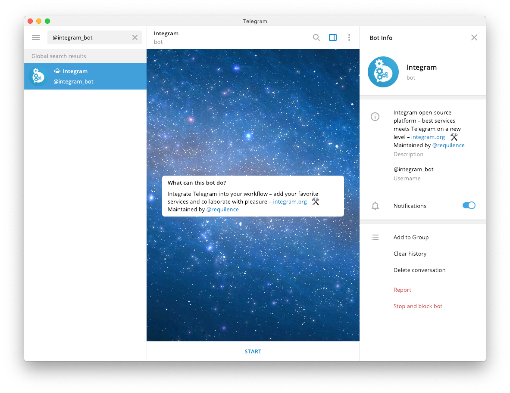
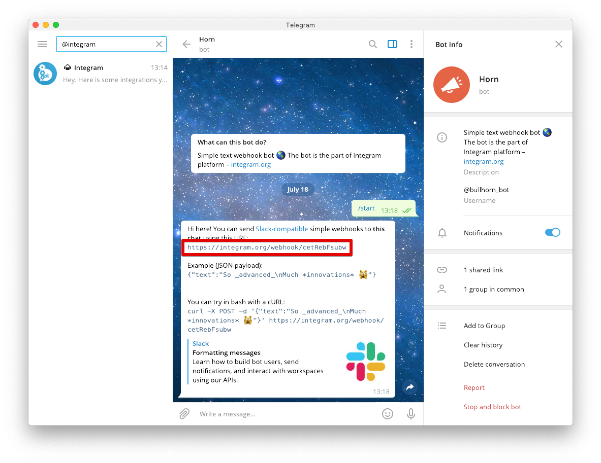

Receive events about subscriptions in Telegram using Webhook URL.

## How to add integration?

1. Install *Integram bot* via this link <a href="https://t.me/integram_bot" target="_blank">https://t.me/integram_bot</a> or find *@integram_bot* in Telegram app:

2. Select *"Start"* and then *"Webhook"*:

3. Copy Webhook URL from bot <a href="https://t.me/bullhorn_bot" target="_blank">bullhorn_bot</a>:

4. In <a href="https://app.apphud.com/" target="_blank">Apphud</a> go to *"Integrations"* and add Telegram:

5. Paste *Webhook URL* at *"Webhook"* field:

6. You can disable unwanted events:

7. Make sure *"Enable this integration"* is checked:

8. Save changes:

## Events

This is a table of all possible events and their parameters that are being sent to Telegram.

> You can get more details regarding events [here](events.md) and event parameters description - [here](integrations.md).

| Event                                                        | Default Name                 | Parameters                                                   |
| ------------------------------------------------------------ | ---------------------------- | ------------------------------------------------------------ |
| *Trial Period*                                               |                              |                                                              |
| Trial period started                                         | `Trial Started`              | `app_name` `group_name` `product_id` `user_id`      |
| Successful conversion from trial period to regular subscription | `Trial Converted`            | `app_name` `group_name` `product_id` `user_id` `price_description` |
| Failed conversion from trial period to regular subscription  | `Trial Expired`              |                                                              |
| *Introductory offer*                                         |                              |                                                              |
| Introductory offer started                                   | `Intro Started`              |                                                              |
| Introductory offer renewed                                   | `Intro Renewed`              |                                                              |
| Successful conversion from introductory offer to regular subscription | `Intro Converted`            |                                                              |
| Failed conversion from introductory offer to regular subscription or failed renew | `Intro Expired`              |                                                              |
| Refund during introductory offer                             | `Intro Refunded`             |                                                              |
| *Regular subscription*                                       |                              |                                                              |
| Subscription started                                         | `Subscription Started`       |                                                              |
| Subscription renewed                                         | `Sbscription Renewed`        | `app_name` `group_name` `product_id` `user_id` `price_description` |
| Subscription expired                                         | `Subscription Expired`       | `app_name` `group_name` `product_id` `user_id` `reason` |
| Subscription refunded                                        | `Subscription Refunded`      |                                                              |
| *Autorenew settings*                                         |                              |                                                              |
| Autorenew disabled                                           | `Autorenew Disabled`         | `app_name` `group_name` `product_id` `user_id` `reason` |
| Autorenew enabled                                            | `[Apphud] autorenew_enabled` |                                                              |

> Set up Subscription Status URL to receive `autorenew_disabled` and `autorenew_enabled` events in real-time. More information can be found [here](creating-app.md#subscription-status-url).

## Send test event

You can test Telegram integration by clicking *"…"* and then in dropdown click on *"Send test event"*:

