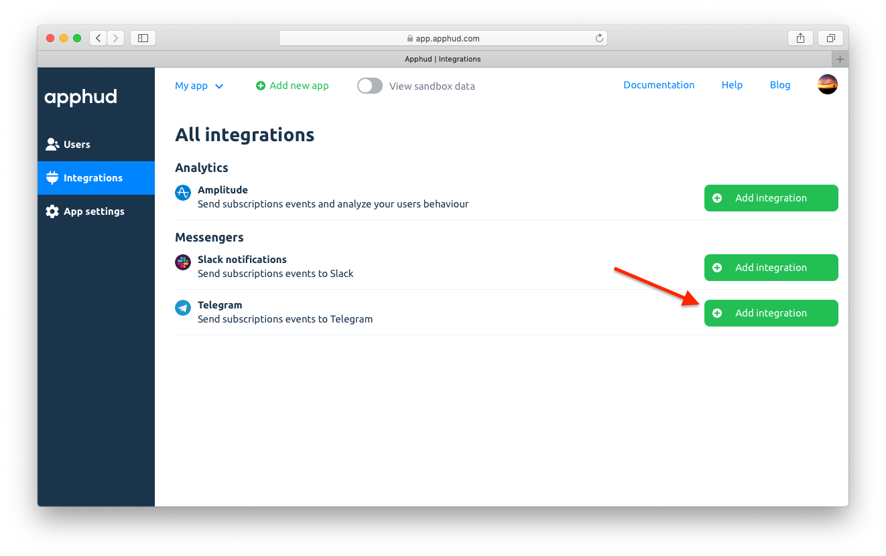
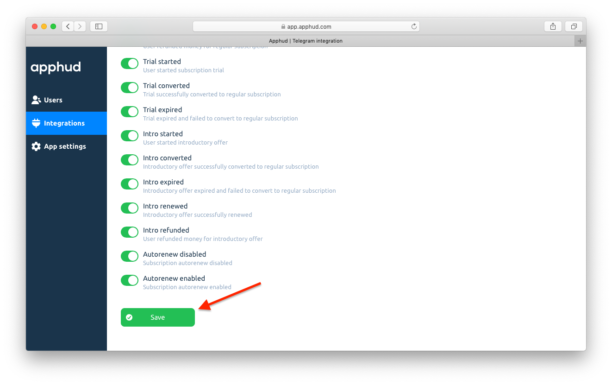

Receive events about subscriptions in Telegram using Webhook URL.

## How to Add Integration?

1. Install *Integram bot* via this link <a href="https://t.me/integram_bot" target="_blank">https://t.me/integram_bot</a> or find *@integram_bot* in Telegram app:

2. Select *"Start"* and then *"Webhook"*:

3. Copy Webhook URL from bot <a href="https://t.me/bullhorn_bot" target="_blank">bullhorn_bot</a>:

4. In <a href="https://app.apphud.com/" target="_blank">Apphud</a> go to *"Integrations"* and add Telegram:

5. Paste *Webhook URL* at *"Webhook"* field:

6. You can disable unwanted events:

7. Make sure *"Enable this integration"* is checked:

8. Save changes:

## Events

This is a table of all possible events that are being sent to Telegram.

> You can get more details regarding events [here](events.md).

| Event                                                        | Default Name            |
| ------------------------------------------------------------ | ----------------------- |
| *Trial Period*                                               |                         |
| Trial period started                                         | `Trial Started`         |
| Successful conversion from trial period to regular subscription | `Trial Converted`       |
| Failed conversion from trial period to regular subscription  | `Trial Expired`         |
| *Introductory offer*                                         |                         |
| Introductory offer started                                   | `Intro Started`         |
| Introductory offer renewed                                   | `Intro Renewed`         |
| Successful conversion from introductory offer to regular subscription | `Intro Converted`       |
| Failed conversion from introductory offer to regular subscription or failed renew | `Intro Expired`         |
| Refund during introductory offer                             | `Intro Refunded`        |
| *Regular subscription*                                       |                         |
| Subscription started                                         | `Subscription Started`  |
| Subscription renewed                                         | `Subscription Renewed`  |
| Subscription expired                                         | `Subscription Expired`  |
| Subscription refunded                                        | `Subscription Refunded` |
| *Promotional offer*                                          |                         |
| Promotional offer started                                    | `Promo Started`         |
| Promotional offer renewed                                    | `Promo Renewed`         |
| Successful conversion from promotional offer to regular subscription | `Promo Converted`       |
| Failed conversion from promotional offer to regular subscription or failed renew | `Promo Expired`         |
| Refund during promotional offer                              | `Promo Refunded`        |
| *Autorenew settings*                                         |                         |
| Autorenew disabled                                           | `Autorenew Disabled`    |
| Autorenew enabled                                            | `Autorenew Enabled`     |

> Set up Subscription Status URL to receive `autorenew_disabled` and `autorenew_enabled` events in real-time. More information can be found [here](creating-app.md#subscription-status-url).

## Send Test Event

You can test Telegram integration by clicking *"…"* and then in dropdown click on *"Send test event"*:

