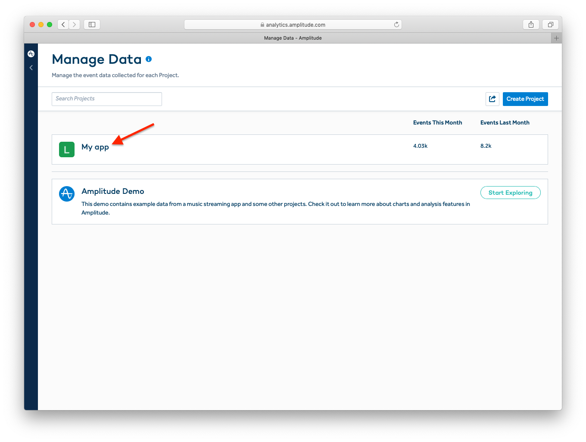
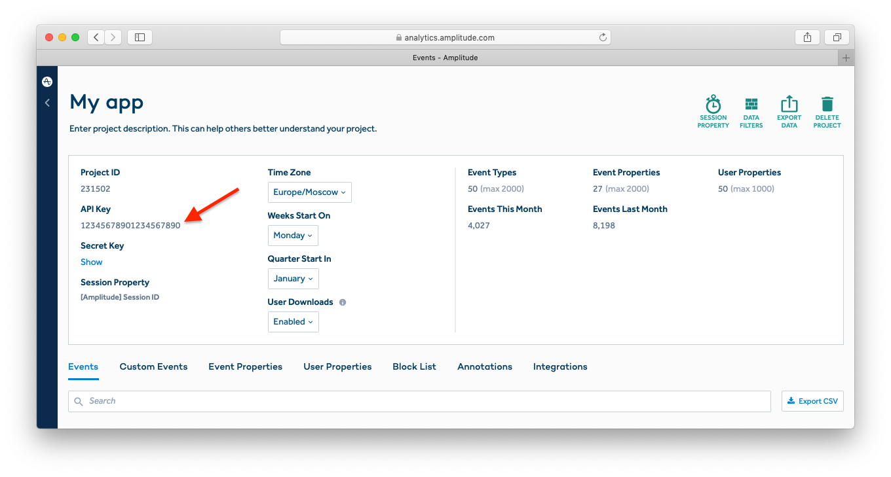
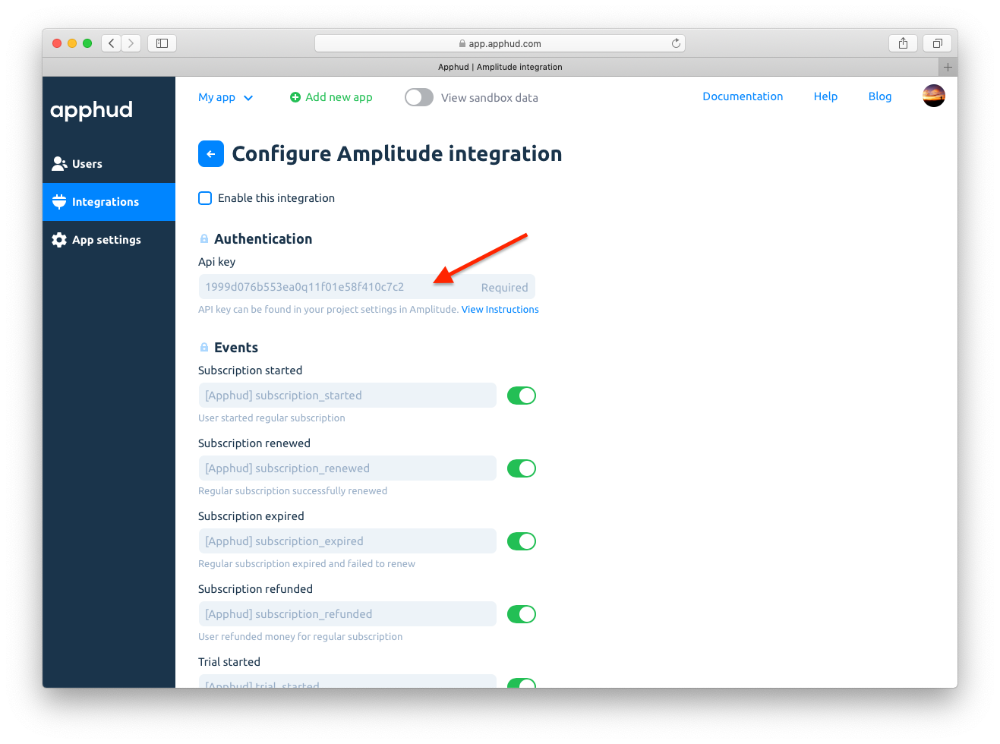
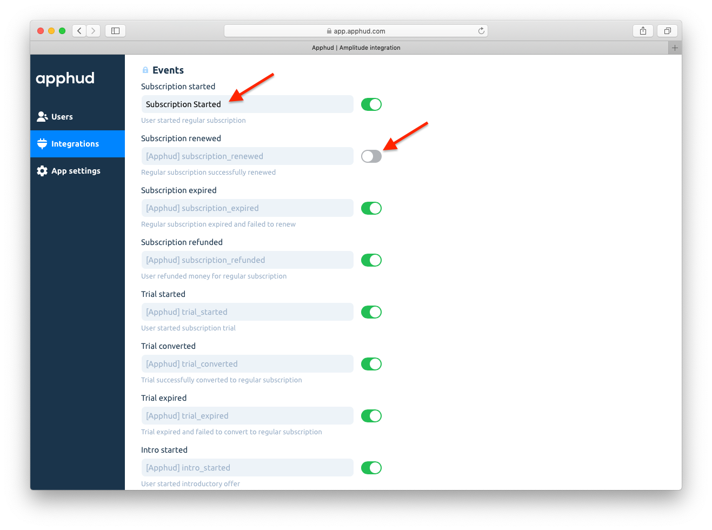
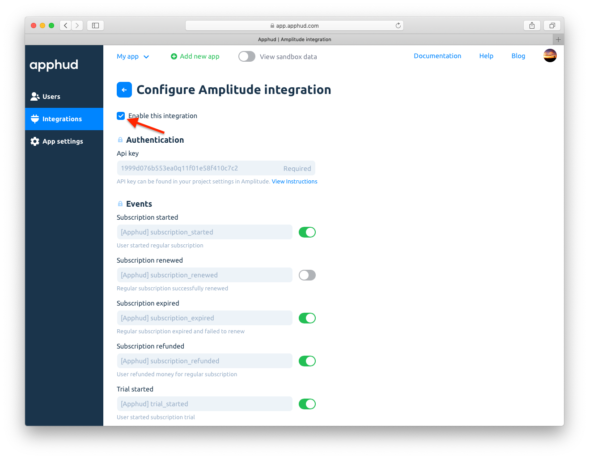

Amplitude это мощная система мобильной аналитики. Отправляйте события из Apphud в Amplitude, анализируйте поведение ваших пользователей и принимайте на их основе решения.

## Как добавить интеграцию? 

1. Откройте <a href="https://analytics.amplitude.com/" target="_blank">Amplitude</a> и войдите в ваш аккаунт.
2. Кликните на *"Manage Data"* в нижней части экрана:

3. Выберите ваше приложение:

4. Скопируйте *Amplitude API Key*:

5. В <a href="https://app.apphud.com/" target="_blank">Apphud</a> перейдите в раздел *"Integrations"* и добавьте Amplitude: 

6. Вставьте скопированный *Amplitude API Key* в поле *"Amplitude API Key"*: 

7. При желании введите собственные названия любого из событий или отключите его отправку в Amplitude:

8. Поставьте галочку напротив *"Enable this integration"*:

9. Сохраните изменения:

## События

В таблице ниже указаны возможные события и их параметры, которые отсылаются в Amplitude. Вы можете задать собственные наименования для каждого события и отключить некоторые их них в настройках интеграции, если нужно.

> Более подробно о событиях можете почитать [здесь](events.md), а о том, что означает каждый из параметров – [здесь](integrations.md).

| Событие                                                      | Наименование по умолчанию        | Параметры и их типы                                          |
| ------------------------------------------------------------ | -------------------------------- | ------------------------------------------------------------ |
| *Триальный период*                                           |                                  |                                                              |
| Оформление триала                                            | `[Apphud] trial_started`         | `product_id`: String `unit`: String `units_count`: Integer |
| Успешная конвертация триала в обычную подписку               | `[Apphud] trial_converted`       | `product_id`: String `local_price`: Float `currency`: String `usd_price`: Float |
| Неудачная конвертация триала в обычную подписку              | `[Apphud] trial_expired`         | `product_id`: String `reason`: String                     |
| *Вводное предложение*                                        |                                  |                                                              |
| Оформление вводного предложения                              | `[Apphud] intro_started`         | `product_id`: String `local_price`: Float `currency`: String `usd_price`: Float `offer_type`: String `unit`: String `units_count`: Integer |
| Успешное продление вводного предложения                      | `[Apphud] intro_renewed`         | `product_id`: String `local_price`: Float `currency`: String `usd_price`: Float `offer_type`: String `unit`: String `units_count`: Integer |
| Успешная конвертация вводного предложения в обычную подписку | `[Apphud] intro_converted`       | `product_id`: String `local_price`: Float `currency`: String `usd_price`: Float `offer_type`: String |
| Неудачная конвертация вводного предложения в обычную подписку | `[Apphud] intro_expired`         | `product_id`: String `reason`: String `offer_type`: String |
| Возврат денег в пределах вводного предложения                | `[Apphud] intro_refunded`        | `product_id`: String `local_price`: Float `currency`: String `usd_price`: Float `reason`: String `offer_type`: String |
| *Обычная подписка*                                           |                                  |                                                              |
| Успешное оформление подписки                                 | `[Apphud] subscription_started`  | `product_id`: String `local_price`: Float `currency`: String `usd_price`: Float |
| Успешное продление подписки                                  | `[Apphud] subscription_renewed`  | `product_id`: String `local_price`: Float `currency`: String `usd_price`: Float |
| Неудачное продление подписки                                 | `[Apphud] subscription_expired`  | `product_id`: String `reason`: String                     |
| Возврат денег                                                | `[Apphud] subscription_refunded` | `product_id`: String `local_price`: Float `currency`: String `usd_price`: Float `reason`: String |
| *Настройки авто-возобновления*                               |                                  |                                                              |
| Отключение авто-возобновления                                | `[Apphud] autorenew_disabled`    | `product_id`: String `reason`: String                     |
| Включение авто-возобновления                                 | `[Apphud] autorenew_enabled`     | `product_id`: String                                         |

> Настройте Subscription Status URL, чтобы своевременно получать события `autorenew_disabled` и `autorenew_enabled`. Более подробно о настройке можно почитать [здесь](creating-app.md#subscription-status-url).
>

Вместе с событиями:

* `[Apphud] trial_converted`,
* `[Apphud] intro_started`,
* `[Apphud] intro_renewed`,
* `[Apphud] intro_converted`,
* `[Apphud] intro_refunded`,
* `[Apphud] subscription_started` 
* `[Apphud] subscription_renewed`,
* `[Apphud] subscription_refunded` 

могут опционально отправляться встроенные в Amplitude параметры, относящиеся к отслеживанию покупок. Более подробно можно почитать <a href="https://help.amplitude.com/hc/en-us/articles/115002278527#tracking-revenue" target="_blank">здесь</a>. Это позволит пользоваться встроенными в Amplitude отчетами о выручке. По умолчанию эта опция **отключена**, но вы можете включить ее в настройках интеграции: 

**// Картинка**

Вот описание параметров, которые отсылаются вместе с этими событиями:

| Параметр      | Тип     | Описание                                                     |
| ------------- | ------- | ------------------------------------------------------------ |
| `productID`   | String  | ID продукта                                                  |
| `quantity`    | Integer | Количество продуктов в покупке. *Всегда равно 1*             |
| `price`       | Float   | Цена покупки в долларах США                                  |
| `revenueType` | String  | Название события. Возможные значения: `trial_converted`, `intro_started`, `intro_renewed`, `intro_converted`, `intro_refunded`, `subscription_started`, `subscription_renewed`, `subscription_refunded` |

## Свойства пользователя 

В таблице ниже указаны свойства пользователя и их типы, которые присваиваются пользователям в Amplitude.

> О том, что означает каждое из свойств, вы можете прочитать [здесь](integrations.md).

| Параметр                        | Тип     |
| ------------------------------- | ------- |
| `[Apphud] status-group_name`    | String  |
| `[Apphud] autorenew-group_name` | Boolean |
| `[Apphud] total_spent`          | Float   |
| `[Apphud] paying`               | Boolean |
| `[Apphud] payments_count`       | Integer |

## Отправка тестового события

