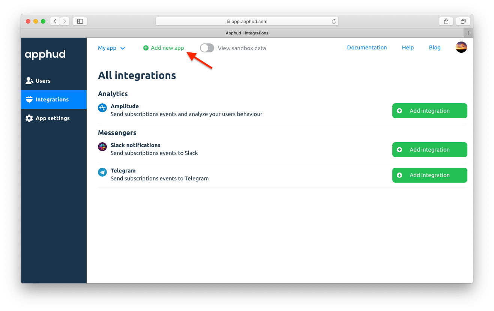

Чтобы создать приложение, нажмите *"Add new app"* в верхней части экрана:

Или просто зарегистрируйтесь и экран создания нового приложения появится автоматически. Заполните информацию о приложении.

## App name

Это название приложение, которое будет указано в отчетах.

## Bundle ID

Узнать уникальный идентификатор iOS-приложения – *Bundle ID* – можно одним из двух способов:

##### Если у вас есть доступ к App Store Connect

1. Откройте <a href="https://appstoreconnect.apple.com/" target="_blank">App Store Connect</a>, перейдите в раздел *"My Apps"* и выберите нужное приложение.
2. На странице приложения найдите ваше значение "ID пакета" (*Bundle ID*).

##### Если у вас нет доступа к App Store Connect

1. Найдите приложение в App Store и откройте его страницу (например, <a href="https://itunes.apple.com/us/app/facebook/id284882215?mt=8" target="_blank">https://itunes.apple.com/us/app/facebook/id284882215?mt=8</a>).
2. Скопируйте число, которое указан в URL между `id` и `?` (в примере: `284882215`).
3. Вставьте идентификатор в URL `https://itunes.apple.com/lookup?id=` после знака `=`: <a href="https://itunes.apple.com/lookup?id=284882215" target="_blank">https://itunes.apple.com/lookup?id=284882215.</a>
4. В файле `1.txt`, который браузер скачает по этому URL, найдите текст *"bundleId"*.

## App Store shared secret

Узнать App Store shared secret можно так:

1. Откройте <a href="https://appstoreconnect.apple.com/" target="_blank">App Store Connect</a>, перейдите в раздел *“My Apps”* и выберите нужное приложение.
2. Перейдите во вкладку *"Functions"*, выберите пункт меню *“In-App Purchases”*.
3. Нажмите *“View Shared Secret”*.

## Subscription Status URL

Мы настоятельно рекомендуем вставить сгенерированный *Subscription Status URL* в настройках вашего приложения в <a href="https://appstoreconnect.apple.com/" target="_blank">App Store Connect</a>. Это позволит сильно увеличить точность создаваемых событий и в реальном времени узнавать, *когда* пользователь отключает возобновление подписки.

> Более подробно о создаваемых событиях можно почитать [здесь](events.md)

1. Откройте <a href="https://appstoreconnect.apple.com/" target="_blank">App Store Connect</a>, перейдите в раздел *“My Apps”* и выберите нужное приложение.
2. В разделе *"General Information"* найдите поле *"Subscription Status URL"*, вставьте сгенерированный URL в это поле и сохраните изменения.