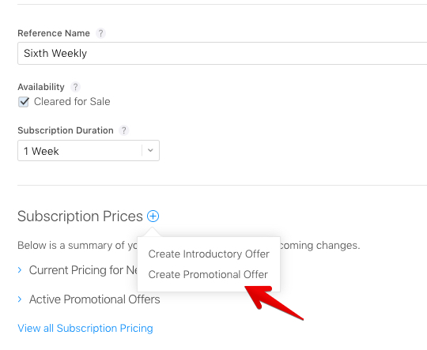
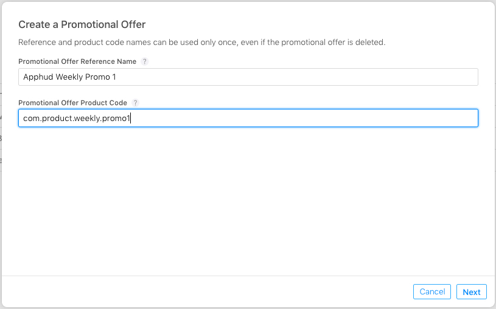
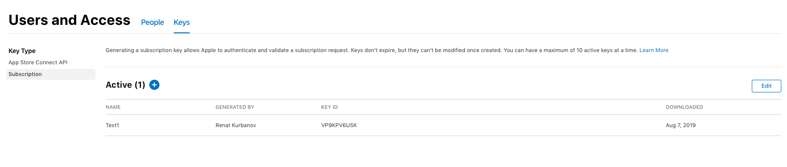
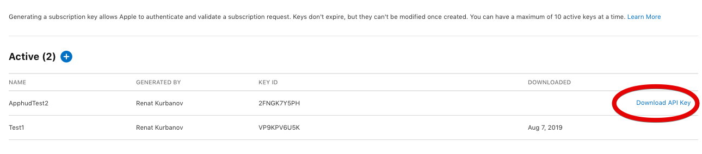
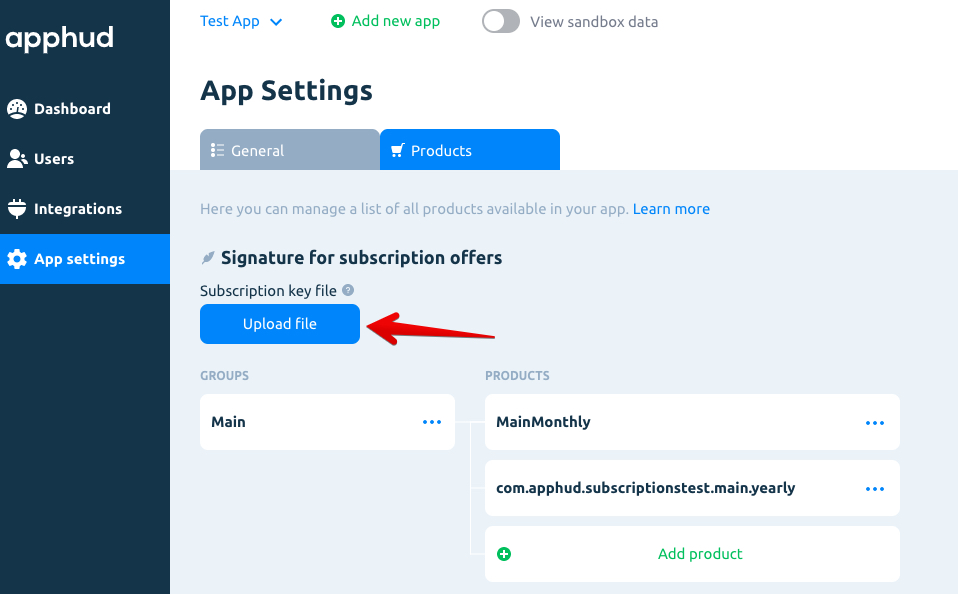

Приложения с авто-возобновляемыми подписками могут предлагать скидки или бесплатный период для существующих или ушедших подписчиков. Эта возможность называется промопредложения, она доступна для всех пользователей с версией iOS 12.2 и выше. В отличие от вводных предложений, промопредложения могут применяться неограниченное количество раз, но требуют создания подписи на вашем сервере для оформления покупки. Apphud сделает работу за вас.

## Настройка промопредложений в App Store Connect

Чтобы создать новое промопредложение, перейдите в [App Store Connect](https://appstoreconnect.apple.com), затем откройте страницу с вашей подпиской. Нажмите "+" в разделе цен на подписку и далее *Создать промопредложение*.



Вам нужно будет указать оригинальное название промопредложения, что является просто названием, и товарный код промопредложения, что является идентификатором.




Далее укажите тип промопредложения и стоимость. Тут все то же самое, что и при создании вводных предложений:

* Оплата по факту использования
* Предоплата
* Бесплатный период

Не забудьте сохранить изменения.


## Ключ Подписки

Как говорилось выше, для использования промопредложений необходимо сгенерировать сгенерировать подпись. Apphud сделает все за вас, однако вам нужно будет создать Ключ подписки и загрузить его в Apphud.

Перейдите в раздел *Пользователи и Доступ*, далее во вкладку *Ключи*. Создайте новый Ключ подписки, указав его имя.



После создания ключа нажмите *Загрузить ключ API* и сохраните файл в безопасном месте. Он будет использован для загрузки в Apphud. 

> Ключ подписки имеет следующий формат названия: SubscriptionKey_[KEY_ID].p8, где KEY_ID – идентификатор ключа. **Пожалуйста, не перeименовывайте файл**.




## Загрузка ключа подписки в Apphud

Перейдите в личный кабинет [Apphud Dashboard](https://app.apphud.com) и откройте *App settings*, далее перейдите во вкладку *Products*. Там вы увидите кнопку для загрузки ключа подписки. Загрузите файл.




## Использование промопредложений

Вы сами решаете, при каких условиях показать промопредложение тому или иному пользователю. Промопредложения появятся в массиве `discounts` вашего объекта `SKProduct`.

После того, как пользователь решил использовать промопредложение, вызовите метод из Apphud SDK для генерации подписи:

```swift
@available(iOS 12.2, *)
    func purchaseProduct(product: SKProduct, promoID: String){
        Apphud.signPromoOffer(productID: product.productIdentifier, discountID: promoID) { (paymentDiscount, error) in
            // continue purchasing
        }
    }
```

В ответ вам вернется объект `SKPaymentDiscount` . Создайте `SKMutablePayment`, указав полученный объект `SKPaymentDiscount` в качестве промопредложения, и иницируйте покупку в App Store как обычно.

В Apphud SDK есть метод покупки с использованием промопредложений:

```swift
@available(iOS 12.2, *)
    func purchaseProduct(product: SKProduct, promoID: String){
        Apphud.signPromoOffer(productID: product.productIdentifier, discountID: promoID) { (paymentDiscount, error) in
            if let discount = paymentDiscount {
                Apphud.makePurchase(product: product, discount: discount, callback: { (subsription, error) in
                    // Purchase finished, check subscription object and an error
                })                
            } else {
                // Signing error occurred, probably because you didn't add Subscription Key file to Apphud.
            }
        }
    }
```