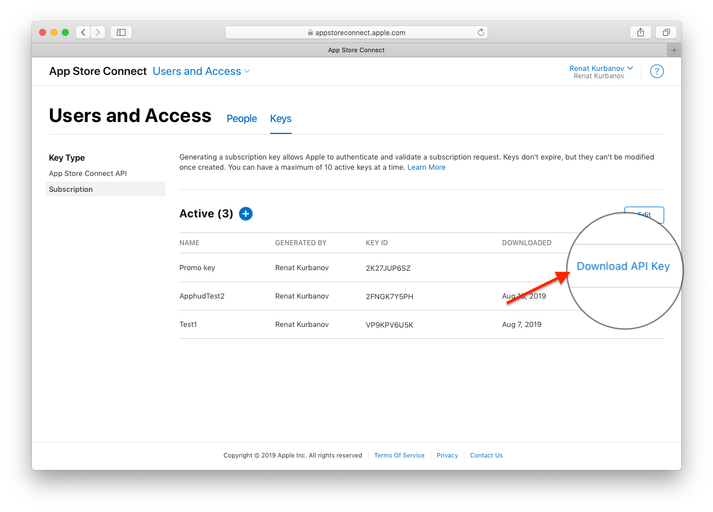
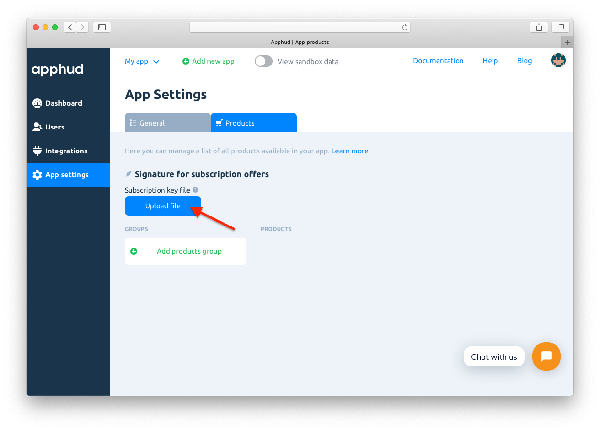

Промо-предложения – это скидки или дополнительный бесплатный пробный период для текущих или бывших подписчиков. Они доступны начиная с iOS 12.2. В отличие от вводных предложений, промо-предложения могут применяться неограниченное количество раз, но требуют создания подписи на вашем сервере для оформления покупки. Apphud сделает работу за вас.

## Настройка промо-предложений в App Store Connect

Чтобы создать новое промо-предложение, перейдите в <a href="https://appstoreconnect.apple.com/" target="_blank">App Store Connect</a> и откройте страницу с вашей подпиской. Нажмите *"+"* в разделе цен на подписку и выберите *"Создать промо-предложение"*.


Укажите оригинальное название промо-предложения и его идентификатор – Product Code.


Укажите стоимость и тип промо-предложения:

* оплата по факту использования;
* предоплата;
* бесплатный период.

Сохраните изменения.

## Ключ подписки

Для использования промо-предложений нужно сгенерировать подпись. Apphud сделает все за вас, вам остается только создать Ключ подписки и загрузить его в Apphud.

Перейдите в раздел *"Пользователи и Доступ"*, далее во вкладку *"Ключи"*. Создайте новый Ключ подписки, указав его имя.


После создания ключа нажмите *"Загрузить ключ API"* и сохраните файл в безопасном месте. Он будет использован для загрузки в Apphud. 

> Ключ подписки имеет следующий формат названия: SubscriptionKey_[KEY_ID].p8, где KEY_ID – идентификатор ключа. **Пожалуйста, не перeименовывайте файл**.




## Загрузка ключа подписки в Apphud

В <a href="https://app.apphud.com/" target="_blank">Apphud</a> откройте настройки приложения. Перейдите на вкладку *"Products"*. Загрузите файл ключа подписки.



## Использование промо-предложений

Вы сами решаете, когда показать промо-предложение пользователю. Промо-предложения появятся в массиве `discounts` вашего объекта `SKProduct`.

После того, как пользователь решил использовать промо-предложение, вызовите метод `signPromoOffer` для генерации подписи:

```swift
@available(iOS 12.2, *)
    func purchaseProduct(product: SKProduct, promoID: String){
        Apphud.signPromoOffer(productID: product.productIdentifier, discountID: promoID) { (paymentDiscount, error) in
            // continue purchasing
        }
    }
```

В ответ вам вернется объект `SKPaymentDiscount` . Создайте `SKMutablePayment`, указав полученный объект `SKPaymentDiscount` в качестве промо-предложения, и иницируйте покупку в App Store как обычно.

В Apphud SDK есть метод покупки с использованием промо-предложений:

```swift
@available(iOS 12.2, *)
    func purchaseProduct(product: SKProduct, promoID: String){
        Apphud.signPromoOffer(productID: product.productIdentifier, discountID: promoID) { (paymentDiscount, error) in
            if let discount = paymentDiscount {
                Apphud.makePurchase(product: product, discount: discount, callback: { (subsription, error) in
                    // Purchase finished, check subscription object and an error
                })                
            } else {
                // Signing error occurred, probably because you didn't add Subscription Key file to Apphud.
            }
        }
    }
```