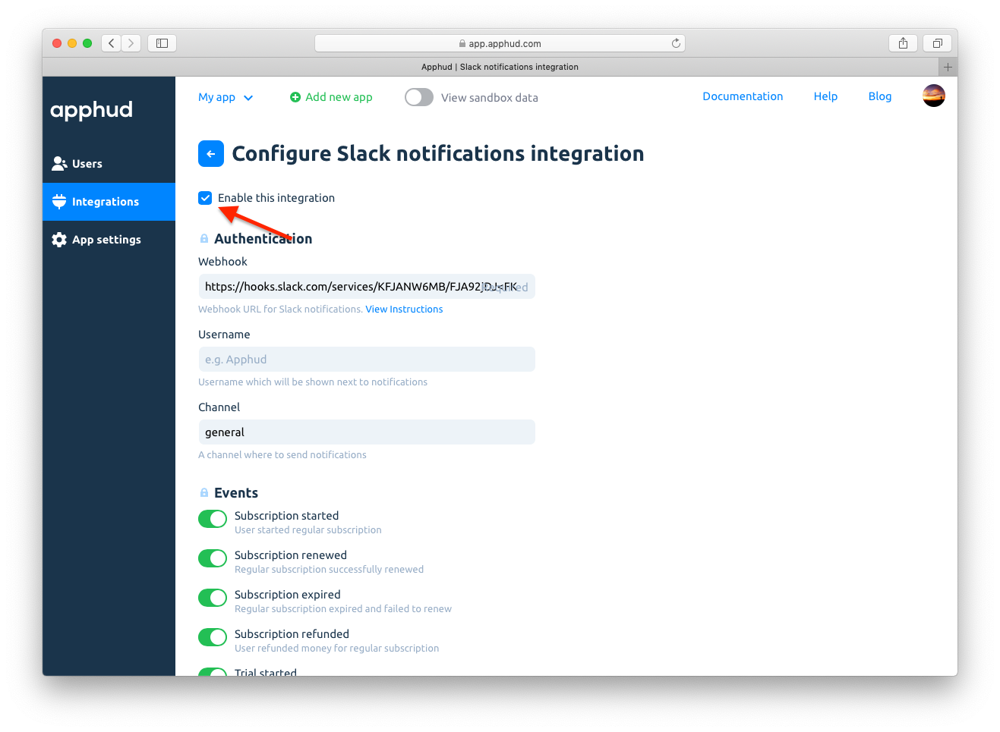

Получайте события о новых и существующих подписках в Slack.

## Как добавить интеграцию?

1. Добавьте <a href="https://slack.com/apps/A0F7XDUAZ-incoming-webhooks" target="_blank">входящий Webhook</a> в ваш аккаунт в Slack.
2. Скопируйте полученный *Webhook URL*.
3. В <a href="https://app.apphud.com/" target="_blank">Apphud</a> перейдите в раздел *"Integrations"* и добавьте Slack: 

4. Вставьте скопированный *Webhook URL* в поле *"Webhook"*. Введите имя, от которого будут приходить уведомления, и укажите название канала:

5. При желании отключите ненужные уведомления, которые вы не хотите получать:

6. Поставьте галочку напротив *"Enable this integration"*:

7. Сохраните изменения:

## События

В таблице ниже указаны возможные события, которые отсылаются в Slack. Вы можете отключить отправку некоторых событий в настройках интеграции.

> Более подробно о событиях можете почитать [здесь](events.md).

| Событие                                                      | Наименование            |
| ------------------------------------------------------------ | ----------------------- |
| *Триальный период*                                           |                         |
| Оформление триала                                            | `Trial Started`         |
| Успешная конвертация триала в обычную подписку               | `Trial Converted`       |
| Неудачная конвертация триала в обычную подписку              | `Trial Expired`         |
| *Вводное предложение*                                        |                         |
| Оформление вводного предложения                              | `Intro Started`         |
| Успешное продление вводного предложения                      | `Intro Renewed`         |
| Успешная конвертация вводного предложения в обычную подписку | `Intro Converted`       |
| Неудачная конвертация вводного предложения в обычную подписку | `Intro Expired`         |
| Возврат денег в пределах вводного предложения                | `Intro Refunded`        |
| *Обычная подписка*                                           |                         |
| Успешное оформление подписки                                 | `Subscription Started`  |
| Успешное продление подписки                                  | `Subscription Renewed`  |
| Неудачное продление подписки                                 | `Subscription Expired`  |
| Возврат денег                                                | `Subscription Refunded` |
| *Промо-предложение*                                          |                         |
| Оформление промо-предложения                                 | `Promo Started`         |
| Успешное продление промо-предложения                         | `Promo Renewed`         |
| Успешная конвертация промо-предложения в обычную подписку    | `Promo Converted`       |
| Неудачная конвертация промо-предложения в обычную подписку   | `Promo Expired`         |
| Возврат денег в пределах промо-предложения                   | `Promo Refunded`        |
| *Настройки авто-возобновления*                               |                         |
| Отключение авто-возобновления                                | `Autorenew Disabled`    |
| Включение авто-возобновления                                 | `Autorenew Enabled`     |

> Настройте Subscription Status URL, чтобы своевременно получать события `autorenew_disabled` и `autorenew_enabled`. Более подробно о настройке можно почитать [здесь](creating-app.md#subscription-status-url).

## Отправка тестового события

Вы можете протестировать интеграцию со Slack, отправив тестовое уведомление. Нажмите *"…"* и выберите *"Send test event"*:

