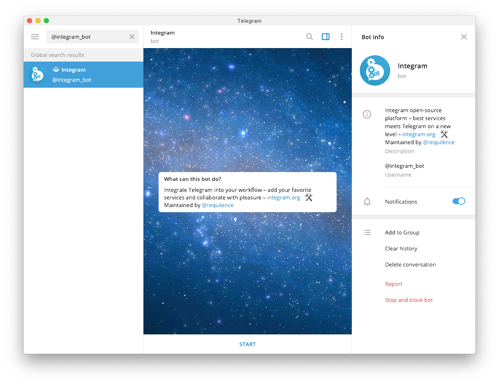
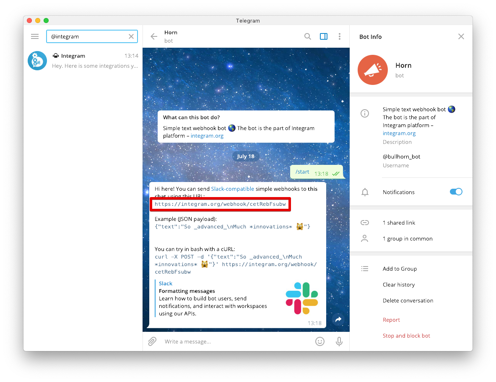
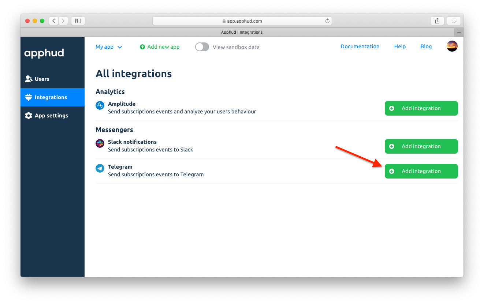
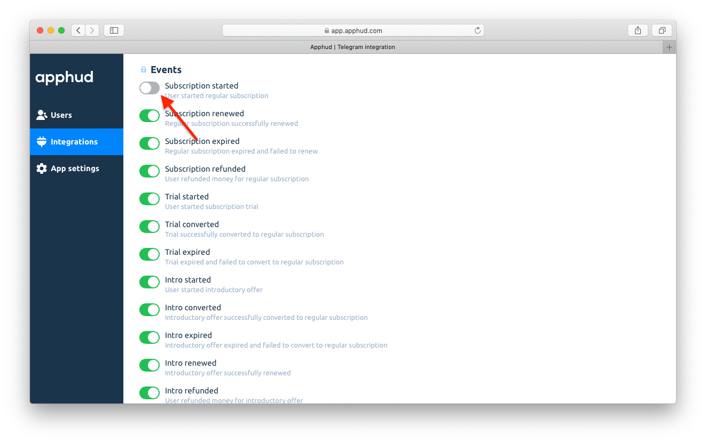
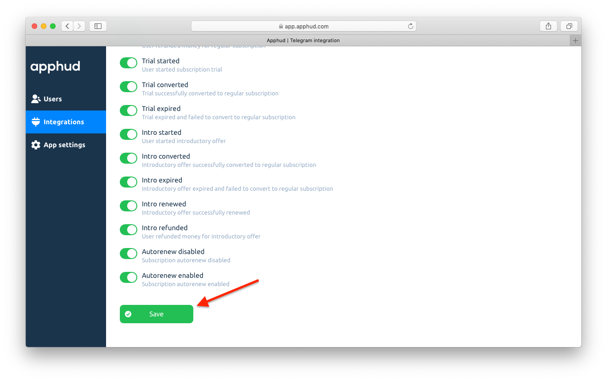

Получайте события о новых и существующих подписках в Telegram используя Webhook URL.

## Как добавить интеграцию?

1. Перейдите по ссылке <a href="https://t.me/integram_bot" target="_blank">https://t.me/integram_bot</a> или откройте Telegram и найдите в поиске бота *@integram_bot*:

2. Нажмите *"Start"* и выберите *"Webhook"*:

3. Скопируйте Webhook URL из бота <a href="https://t.me/bullhorn_bot" target="_blank">bullhorn_bot</a>

4. В <a href="https://app.apphud.com/" target="_blank">Apphud</a> перейдите в раздел *"Integrations"* и добавьте Telegram:

5. Вставьте скопированный *Webhook URL* в поле *"Webhook"*:

6. При желании отключите ненужные уведомления, которые вы не хотите получать:

7. Поставьте галочку напротив *"Enable this integration"*:

8. Сохраните изменения:

## События

В таблице ниже указаны возможные события и их параметры, которые отсылаются в Telegram. Вы можете отключить отправку некоторых событий в настройках интеграции.

> Более подробно о событиях можете почитать [здесь](events.md), а о том, что означает каждый из параметров – [здесь](integrations.md).

| Событие                                                      | Наименование                 | Параметры и их типы                                          |
| ------------------------------------------------------------ | ---------------------------- | ------------------------------------------------------------ |
| *Триальный период*                                           |                              |                                                              |
| Оформление триала                                            | `Trial Started`              | `app_name` `group_name` `product_id` `user_id`      |
| Успешная конвертация триала в обычную подписку               | `Trial Converted`            | `app_name` `group_name` `product_id` `user_id` `price_description` |
| Неудачная конвертация триала в обычную подписку              | `Trial Expired`              |                                                              |
| *Вводное предложение*                                        |                              |                                                              |
| Оформление вводного предложения                              | `Intro Started`              |                                                              |
| Успешное продление вводного предложения                      | `Intro Renewed`              |                                                              |
| Успешная конвертация вводного предложения в обычную подписку | `Intro Converted`            |                                                              |
| Неудачная конвертация вводного предложения в обычную подписку | `Intro Expired`              |                                                              |
| Возврат денег в пределах вводного предложения                | `Intro Refunded`             |                                                              |
| *Обычная подписка*                                           |                              |                                                              |
| Успешное оформление подписки                                 | `Subscription Started`       |                                                              |
| Успешное продление подписки                                  | `Sbscription Renewed`        | `app_name` `group_name` `product_id` `user_id` `price_description` |
| Неудачное продление подписки                                 | `Subscription Expired`       | `app_name` `group_name` `product_id` `user_id` `reason` |
| Возврат денег                                                | `Subscription Refunded`      |                                                              |
| *Настройки авто-возобновления*                               |                              |                                                              |
| Отключение авто-возобновления                                | `Autorenew Disabled`         | `app_name` `group_name` `product_id` `user_id` `reason` |
| Включение авто-возобновления                                 | `[Apphud] autorenew_enabled` |                                                              |

> Настройте Subscription Status URL, чтобы своевременно получать события `autorenew_disabled` и `autorenew_enabled`. Более подробно о настройке можно почитать [здесь](creating-app.md#subscription-status-url).

## Отправка тестового события 

Вы можете протестировать интеграцию с Telegram, отправив тестовое уведомление. Нажмите *"…"* и выберите *"Send test event"*:

